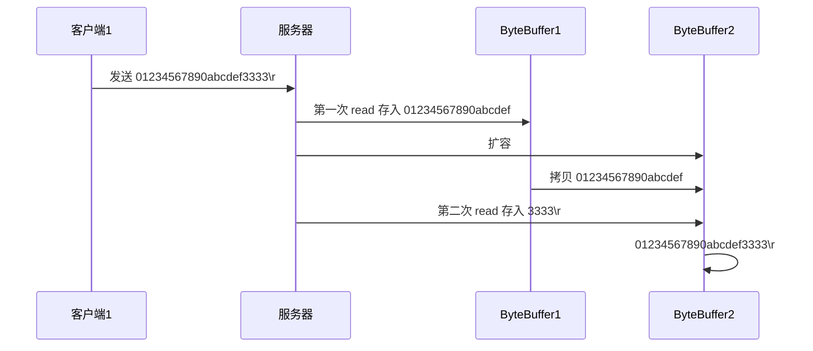

# JavaWeb

## XML


## JSON


## Servlet


## 监听器Listener


## 过滤器Filter

作用：一般用来进行请求的过滤和拦截。但是也能对响应进行过滤拦截。


实现方法：一般在一个类上加上@WebFilter注解，其中用filterName表示过滤器的名称，urlPatterns表示拦截的路径，然后实现一个接口Filter。实现接口后要重写doFilter方法，其中书写逻辑。

```java
@WebFilter(filterName = "myFilter",urlPatterns = "/path")
public class MyFilter implements Filter {
    @Override
    public void init(FilterConfig filterConfig) throws ServletException {
	//filter初始化的时候调用
        Filter.super.init(filterConfig);
    }
    @Override
    public void doFilter(ServletRequest servletRequest, ServletResponse servletResponse, FilterChain filterChain) throws IOException, ServletException {
        //请求会先到这里，然后在到controller层
	filterChain.doFilter(servletRequest, servletResponse);
    }

    @Override
    public void destroy() {
        //filter被销毁的收调用
        Filter.super.destroy();
    }
}
```

### Filter的生命周期

#### Filter的创建

　　Filter的创建和销毁由WEB服务器负责。 web 应用程序启动时，web 服务器将创建Filter 的实例对象，并调用其init方法，完成对象的初始化功能，从而为后续的用户请求作好拦截的准备工作，filter对象只会创建一次，init方法也只会执行一次。通过init方法的参数，可获得代表当前filter配置信息的FilterConfig对象。

#### Filter的销毁

　　Web容器调用destroy方法销毁Filter。destroy方法在Filter的生命周期中仅执行一次。在destroy方法中，可以释放过滤器使用的资源。

#### FilterConfig接口（在init方法中使用）

　　用户在配置filter时，可以使用为filter配置一些初始化参数，当web容器实例化Filter对象，调用其init方法时，会把封装了filter初始化参数的filterConfig对象传递进来。因此开发人员在编写filter时，通过filterConfig对象的方法，就可获得：

- String getFilterName()：得到filter的名称。
- String getInitParameter(String name)： 返回在部署描述中指定名称的初始化参数的值。如果不存在返回null.
- Enumeration getInitParameterNames()：返回过滤器的所有初始化参数的名字的枚举集合。
- public ServletContext getServletContext()：返回Servlet上下文对象的引用。

### Filter的属性

- lterName：该filter的名字
- initParams：初始化参数
- displayName：filter显示名称
- servletNames：指定对哪些servlet进行过滤
- asyncSupported：是否支持异步模式
- urlPatterns：指定拦截路径
- value：指定拦截路径

​        注意：urlPatterns和value是一样的。urlPatterns和value只能配置一个，不能两个都配置，两个都配置就会报错。

**urlPatterns**：配置要拦截的资源

1. 以指定资源匹配。例如"/index.jsp"
2. 以目录匹配。例如"/servlet/*"
3. 以后缀名匹配，例如"*.jsp"
4. 通配符，拦截所有web资源。"/*"

**initParams**：配置初始化参数，跟Servlet配置一样，例如

```java
initParams = {
        @WebInitParam(name = "key",value = "value")
}
```

**dispatcherTypes**：配置拦截的类型，可配置多个。默认为DispatcherType.REQUEST。例如dispatcherTypes = {DispatcherType.ASYNC,DispatcherType.ERROR}

其中DispatcherType是个枚举类型，有下面几个值

> FORWARD,//转发的
> INCLUDE,//包含在页面的
> REQUEST,//请求的
> ASYNC,//异步的
> ERROR;//出错的

### 多个Filter的执行顺序

一般按照一下标准：

- 如果我们是在web.xml中配置的过滤器，那么过滤器的执行顺序就是<filter-mapping>在web配置的顺序，配置在上面那么就会先执行。
- 如果我们是使用@WebFilter进行配置的，那么执行顺序就是字符比较顺序来执行，例如有2个过滤器，一个是AFilter，一个是BFilter，那么AFilter就会先执行。
- 如果注解和xml混用，那么在web.xml中配置的会先执行。

## JSP


## Cookie


## Session

## Tomcat服务器


# 框架

## Maven

Maven是Apache旗下的一个开源项目，是一款用于管理和构建java项目的工具。

官网：https://maven.apache.org/

> Apache 软件基金会，成立于1999年7月，是目前世界上最大的最受欢迎的开源软件基金会，也是一个专门为支持开源项目而生的非盈利性组织。
>
> 开源项目：https://www.apache.org/index.html#projects-list

**maven的作用：**

1. 方便的依赖管理
2. 统一的项目结构
3. 标准的项目构建流程

详细见Maven文档。

##Spring

**Spring是一个轻量级的控制反转(IoC)和面向切面(AOP)的容器（框架）。**

Spring 框架是一个分层架构，由 7 个定义良好的模块组成。Spring 模块构建在核心容器之上，核心容器定义了创建、配置和管理 bean 的方式 .

> 组成 Spring 框架的每个模块（或组件）都可以单独存在，或者与其他一个或多个模块联合实现。每个模块的功能如下：
>
> - **核心容器**：核心容器提供 Spring 框架的基本功能。核心容器的主要组件是 BeanFactory，它是工厂模式的实现。BeanFactory 使用*控制反转*（IOC） 模式将应用程序的配置和依赖性规范与实际的应用程序代码分开。
> - **Spring 上下文**：Spring 上下文是一个配置文件，向 Spring 框架提供上下文信息。Spring 上下文包括企业服务，例如 JNDI、EJB、电子邮件、国际化、校验和调度功能。
> - **Spring AOP**：通过配置管理特性，Spring AOP 模块直接将面向切面的编程功能 , 集成到了 Spring 框架中。所以，可以很容易地使 Spring 框架管理任何支持 AOP的对象。Spring AOP 模块为基于 Spring 的应用程序中的对象提供了事务管理服务。通过使用 Spring AOP，不用依赖组件，就可以将声明性事务管理集成到应用程序中。
> - **Spring DAO**：JDBC DAO 抽象层提供了有意义的异常层次结构，可用该结构来管理异常处理和不同数据库供应商抛出的错误消息。异常层次结构简化了错误处理，并且极大地降低了需要编写的异常代码数量（例如打开和关闭连接）。Spring DAO 的面向 JDBC 的异常遵从通用的 DAO 异常层次结构。
> - **Spring ORM**：Spring 框架插入了若干个 ORM 框架，从而提供了 ORM 的对象关系工具，其中包括 JDO、Hibernate 和 iBatis SQL Map。所有这些都遵从 Spring 的通用事务和 DAO 异常层次结构。
> - **Spring Web 模块**：Web 上下文模块建立在应用程序上下文模块之上，为基于 Web 的应用程序提供了上下文。所以，Spring 框架支持与 Jakarta Struts 的集成。Web 模块还简化了处理多部分请求以及将请求参数绑定到域对象的工作。
> - **Spring MVC 框架**：MVC 框架是一个全功能的构建 Web 应用程序的 MVC 实现。通过策略接口，MVC 框架变成为高度可配置的，MVC 容纳了大量视图技术，其中包括 JSP、Velocity、Tiles、iText 和 POI。

**Spring Boot与Spring Cloud**

> - Spring Boot 是 Spring 的一套快速配置脚手架，可以基于Spring Boot 快速开发单个微服务;
> - Spring Cloud是基于Spring Boot实现的；
> - Spring Boot专注于快速、方便集成的单个微服务个体，Spring Cloud关注全局的服务治理框架；
> - Spring Boot使用了约束优于配置的理念，很多集成方案已经帮你选择好了，能不配置就不配置 , Spring Cloud很大的一部分是基于Spring Boot来实现，Spring Boot可以离开Spring Cloud独立使用开发项目，但是Spring Cloud离不开Spring Boot，属于依赖的关系。
> - SpringBoot在SpringClound中起到了承上启下的作用，如果你要学习SpringCloud必须要学习SpringBoot。

**Spring中的注解**

原始注解：


新注解：


Spring利用这些注解以进行快速开发。

### IOC控制反转和DI依赖注入

​	**控制反转IoC(Inversion of Control)，是一种设计思想，DI(依赖注入)是实现IoC的一种方法。**没有IoC的程序中 , 我们使用面向对象编程 , 对象的创建与对象间的依赖关系完全硬编码在程序中，对象的创建由程序自己控制，控制反转后将对象的创建转移给第三方，将对象的创建交给Spring的容器进行管理，当要使用时使用DI的依赖注入实现对象的创建。

​	**Bean**:在Spring中，那些组成应用程序的主体及由Spring IoC容器所管理的对象，被称之为bean。简单地讲，bean就是由IoC容器初始化、装配及管理的对象 .

```java
@Component  //将这个类标注为Spring的一个组件，放到容器中！
public class Cat {
   public void shout() {
       System.out.println("miao~");
  }
}
@Component  //将这个类标注为Spring的一个组件，放到容器中！
public class Dog {
   public void shout() {
       System.out.println("wang~");
  }
}
public class User {
   @Autowired  //进行Bean的注入，可以实现cat的实体类，并且调用cat的方法
   private Cat cat;
   @Autowired
   private Dog dog;
   cat.shout();
   dog.shout();
}
```

 ### AOP

> AOP（Aspect Oriented Programming）意为：面向切面编程，通过预编译方式和运行期动态代理实现程序功能的统一维护的一种技术。AOP是OOP的延续，是软件开发中的一个热点，也是Spring框架中的一个重要内容，是函数式编程的一种衍生范型。利用AOP可以对业务逻辑的各个部分进行隔离，从而使得业务逻辑各部分之间的耦合度降低，提高程序的可重用性，同时提高了开发的效率。

#### Aop在Spring中的作用

提供声明式事务；允许用户自定义切面。**能在不惊动原始设计的基础上为其进行功能增强**。

以下名词需要了解下：

- 横切关注点：跨越应用程序多个模块的方法或功能。即是，与我们业务逻辑无关的，但是我们需要关注的部分，就是横切关注点。如日志 , 安全 , 缓存 , 事务等等 …
- 切面（ASPECT）：横切关注点 被模块化 的特殊对象。即，它是一个类。
- 通知（Advice）：切面必须要完成的工作。即，它是类中的一个方法。
- 目标（Target）：被通知对象。
- 代理（Proxy）：向目标对象应用通知之后创建的对象。
- 切入点（PointCut）：切面通知 执行的 “地点”的定义。
- 连接点（JointPoint）：与切入点匹配的执行点。


## SpringMvc

### 文件上传下载

#### 文件的上传

前题条件

- 请求方式：提供`form`表单，`method`必须是`post`
- 数据类型：表单必须设置`enctype="multipart/form-data"`
- 控件：需要使用控件`< input type="file" name="file">` 控件必须有名称

```java
<form action="upload" method="post" enctype="multipart/form-data">
        <input type="file" name="file">
        <button>上传</button>
</form>
```

上传文件一般使用MultipartFile类，这个类是SpringMvc提供简化文件流操作的接口。例如：

```java
/**
 * 文件的上传
 */
@Slf4j
@RestController
@RequestMapping("/common")
public class commonController {
    @Value("${basefileupload.path}") //将配置文件中的地址前缀导入
    private String path;
    /**
     * 文件的上传。
     * @param file
     * @return
     */
    @PostMapping("/upload")
    public R<String> upload(@RequestPart("file") MultipartFile file){
        log.info(file.toString());
        //获取到上传文件的名称
        final String filename = file.getOriginalFilename();
        //将文件名称进行分割，获取到后缀
        final String s = filename.substring(filename.lastIndexOf("."));
        //为文件生成一个uuid防止重复命名
        final String uuid = UUID.randomUUID().toString();
        //当配置文件中，配置的目的地为D:\test_img\时，需要创建一个目录，将文件存到其中
        File file1=new File(path);
        //进行判断这个文件夹是否存在。
        if(!file1.exists()){
            file1.mkdirs();
        }
        //使用transferTo方法，将文件进行转发到指定路径。
        try {
            file.transferTo(new File(path+uuid+s));
        } catch (IOException e) {
            throw new RuntimeException(e);
        }
        return R.success(filename);
    }
}
```

前端发送的数据如下：

> Content-Disposition: form-data; name="file"; filename="3fabb83a-1c09-4fd9-892b-4ef7457daafa.jpeg"
> Content-Type: image/jpeg

其中的MultipartFile对应的名称必须与前端请求中的name值保持一致，也可以使用@RequestPart注解，注解中写前端发送的文件名。

MultipartFile中的方法：

- String getContentType()                 //获取文件MIME类型
- InputStream getInputStream()         //后去文件流
- String getName()                          //获取表单中文件组件的名字
- String getOriginalFilename()           //获取上传文件的原名
- long getSize()                              //获取文件的字节大小，单位byte
- boolean isEmpty()                        //是否为空
- ==void transferTo(File dest)==             //保存到一个目标文件中

#### 文件的下载

```java
/**
     * 文件的下载
     * @param name
     * @param response
     * @return
     * @throws IOException
     */
    @GetMapping("/download")
    public R<String> download(String name, HttpServletResponse response) throws IOException {
        try {
            //创建一个输入流，从本地输入
            FileInputStream fileInputStream=new FileInputStream(new File(path+name));
            //创建一个输出流，上传到浏览器
            ServletOutputStream servletOutputStream=response.getOutputStream();
            int len=0;
            byte[] bytes= new byte[1024];//一次读1024个bit位。
            while((len=fileInputStream.read(bytes)!=-1){
                servletOutputStream.write(bytes,0,len);
                servletOutputStream.flush();
            }
            fileInputStream.close();
            servletOutputStream.close();

        } catch (IOException e) {
            throw new RuntimeException(e);
        }
        return null;
    }
```

### HttpClient

使用这个类可以在java程序中发送请求，在本身是一个接口。

例如：

```java
	/**
     * 发送Get请求
     */
    @Test
    public void GetTest() throws Exception{
        //创建HttpClient对象,因为HttpClient是一个接口，所以使用HttpClients.createDefault()方法创建对象，
        //CloseableHttpClient这个类是HttpClient接口的实现类。
        CloseableHttpClient client = HttpClients.createDefault();
        //创建Get请求对象,参数为请求地址url
        HttpGet httpGet=new HttpGet("http://localhost:8080/user/shop/status");
        //发送Get请求,返回值为响应体
        CloseableHttpResponse response = client.execute(httpGet);
        //获取响应码
        int code = response.getStatusLine().getStatusCode();
        System.out.println("响应码为："+code);
        //获取响应体，并且使用工具类对返回结果进行解析
        final HttpEntity entity = response.getEntity();
        final String s = EntityUtils.toString(entity);
        System.out.println(s);

        //关闭资源
        response.close();
        client.close();
    }
    /**
     * 发送Get请求
     */
    @Test
    public void PostTest() throws Exception{
        //创建httpClient对象
        final CloseableHttpClient client = HttpClients.createDefault();
        //创建post对象
        HttpPost httpPost =new HttpPost("http://localhost:8080/admin/employee/login");
        //post请求一般具有参数，比如登录需要用户名和密码
        JSONObject jsonObject=new JSONObject();
        jsonObject.put("username","admin");
        jsonObject.put("password","123456");
        //创建请求参数
        StringEntity stringEntity=new StringEntity(jsonObject.toString());
        //设置编码
        stringEntity.setContentEncoding("utf-8");
        //设置请求参数的格式为json格式
        stringEntity.setContentType("application/json");
        //放入请求参数
        httpPost.setEntity(stringEntity);
        //发送post请求,并且获取到返回值
        final CloseableHttpResponse response = client.execute(httpPost);
        //获取响应码
        int code = response.getStatusLine().getStatusCode();
        System.out.println("响应码为："+code);
        //获取响应体，并且使用工具类对返回结果进行解析
        final HttpEntity entity = response.getEntity();
        final String s = EntityUtils.toString(entity);
        System.out.println(s);

        //关闭资源
        response.close();
        client.close();
    }
```

例如上述使用方法，就可以在java程序中方式http请求。


## SpringBoot

#### 简介

​	springboot是spring家族中的一个全新框架，用来简化spring程序的创建和开发过程。在以往我们通过SpringMVC+Spring+Mybatis框架进行开发的时候，我们需要配置web.xml，spring配置，mybatis配置，然后整合在一起，而springboot抛弃了繁琐的xml配置过程，采用大量默认的配置来简化我们的spring开发过程。SpringBoot化繁为简，使开发变得更加的简单迅速。

####  特性

- 能够快速创建基于spring的程序
- 能够直接使用Java main方法启动内嵌的Tomcat服务器运行springboot程序，不需要部署war包
- 提供约定的starter POM来简化Maven配置，让Maven的配置变得简单
- 自动化配置，根据项目的Maven依赖配置，springboot自动配置spring、springmvc等
- 提供了程序的健康检查功能
- 基本可以完全不使用xml配合文件，采用注解配置

#### 在idea中创建SpringBoot项目

创建成功的目录如下


其中各个文件夹的用处为：

> - java：中存放java的代码
> - test：中存放用来进行测试的代码
> - static：存放静态资源。如图片、CSS、JavaScript 等 
> - templates：存放 Web 页面的模板文件 
> - application.properties/application.yml 用于存放程序的各种依赖模块的配置信息，比如 服务端口，数据库连接配置等
> - .gitignore：使用版本控制工具 git 的时候，设置一些忽略提交的内容 
> - Application.java：SpringBoot 程序执行的入口，执行该程序中的 main 方法，启动当前SpringBoot项目。

## Spring Security


## Spring Cache

是spring提供的一个基于注解的缓存框架，可以快速的进行缓存操作。

maven坐标为：

```java
<dependency>
	<groupId>org.springframework.boot</groupId>
	<artifactId>spring-boot-starter-cache</artifactId>
</dependency>
```

常用注解：

**@EnableCaching注解：**

> 这个注解一般用在启动类上，表示开启缓存功能。

**@Cacheable注解：**

> 这个注解一般用在**查询方法**上， @Cacheble注解表示这个方法有了缓存的功能，方法的**返回值**会被缓存下来，下一次调用该方法前，会去检查是否缓存中已经有值，如果有就直接返回，不调用方法。如果没有，就调用方法，然后把结果缓存起来。

例如：

```java
//这样key的生成为：dishCache::Id 
@Cacheable(cacheNames = "dishCache",key = "#Id")
```

**@CacheEvict注解：**

> 使用了CacheEvict注解的方法，会清空指定缓存。

例如：

```java
//删除key为dishCache::Id的键值对
@CacheEvict(cacheNames = "dishCache",key = "#Id")
//删除以dishCache开头的所有的key
@CacheEvict(cacheNames = "dishCache",allEntries = true)
```

**@CachePut注解：**

> 使用了@CachePut注解的方法，会把方法的返回值put到缓存里面缓存起来，供其它地方使用。它「通常用在新增方法上」

例如：

```java
//这样key的生成为：dishCache::Id 
@CachePut(cacheNames = "dishCache",key = "#dishDTO.Id")//根据参数名称
@CachePut(cacheNames = "dishCache",key = "#result.Id")//根据返回值
@CachePut(cacheNames = "dishCache",key = "#p0.Id")//根据函数的第一个参数，后面还有p1,p2....
```


## Spring Task

是spring框架中提供的任务调度工具，可以在某个制定好的时间自动的完成某项任务。例如闹钟

Spring Task使用步骤：
第一步：在Spring Boot 默认在无任何第三方依赖的情况下使用 `spring-context` 模块下提供的定时任务工具 **Spring Task**。我们只需要使用 `@EnableScheduling` 注解就可以开启相关的定时任务功能。如：

```java
@SpringBootApplication
@EnableScheduling
public class SpringbootScheduleApplication {
    public static void main(String[] args) {
        SpringApplication.run(SpringbootScheduleApplication.class, args);
    }
}
```

第二步：使用**@Scheduled 注解**，在一个方法上。这个方法的类要加上**@Component注解**，交给spring管理这个类。如：

```java
@Component
public class TaskService {

    @Scheduled(fixedDelay = 1000)
    public void task() {
        System.out.println("Thread Name : "
                    + Thread.currentThread().getName() + "task : date ->  "
                    + LocalDateTime.now().format(DateTimeFormatter.ofPattern("yyyy-MM-dd HH:mm:ss")));
    }
}
```

`@Scheduled` 注解中一定要声明定时任务的执行策略 `cron` 、`fixedDelay`、`fixedRate` 三选一。

**1 cron 表达式**==（最常使用）==

使用网上的cron表达式生成网站。

**2 fixedDelay**

它的间隔时间是根据上次的任务结束的时候开始计时的，只要盯紧上一次执行结束的时间即可，跟任务逻辑的执行时间无关，两个轮次的间隔距离是固定的。

**3 initialDelay**

initialDelay初始化延迟时间，也就是第一次延迟执行的时间。这个参数对 `cron` 属性无效，只能配合 `fixedDelay` 或 `fixedRate` 使用。如 `@Scheduled(initialDelay=5000,fixedDelay = 1000)` 表示第一次延迟 `5000` 毫秒执行，下一次任务在上一次任务结束后 `1000` 毫秒后执行。


## Mybatis

 	mybatis是一个优秀的基于java的持久层框架，它内部封装了jdbc，使开发者只需要关注sql语句本身，而不需要花费精力去处理加载驱动、创建连接、创建statement等繁杂的过程。

使用方法：引入依赖

```java
<dependency>
  <groupId>org.mybatis</groupId>
  <artifactId>mybatis</artifactId>
  <version>x.x.x</version>
</dependency>
```


## MybatisPlus

### BaseMapper接口

​	是mybatis-plus中封装的一个接口，主要用于Mapper层。其中提供了常用的对单表的增删改查的操作。当需要对数据库进行操作时，就不用自己手写sql语句了，直接使用接口中的方法。BaseMapper后面要跟一个实体对象类。

```java
@Mapper
public interface UserMapper extends BaseMapper<User> {
}
```

接口中的方法：

| 类型 | 描述                                                         |
| ---- | ------------------------------------------------------------ |
| 增加 | insert                                                       |
| 删除 | deleteById   deleteByMap  deleteBatchIds delete              |
| 更新 | updateById  update                                           |
| 查询 | selectById  selectBatchIds  selectByMap  selectOne  selectCount  selectList  selectMaps  selectObjs  selectPage  selectMapsPage |

有些方法为条件查询，那么需要使用条件构造器或者创建一个map，里面用来存储条件：

例如用map存储查询条件：

```java
	@Autowired
    private EmpMapper empMapper;
	public void test(){
        HashMap<String,Object> map=new HashMap<>();
        map.put("name","tom");
        map.put("age",18);
        final List<Employee> list = empMapper.selectByMap(map);
        list.forEach(System.out::println);
    }
结果为：查询name为tom并且age=18岁的人。
```

### **条件构造器**


- Wrapper：顶级父类
  - AbstractWrapper：用来查询条件封装，形成where条件
    - QueryWrapper：查询条件封装
    - UpdateWrapper：更新条件封装
    - AbstractLambdaWrapper：使用Lambda语法，更加简洁
      - LambdaUpdateWrapper：基于Lambda语法的更新查询
      - LambdaQueryWrapper：基于Lambda语法的查询封装

构造器中的方法可以查看官方文档：[条件构造器 | MyBatis-Plus (baomidou.com)](https://baomidou.com/pages/10c804/#abstractwrapper)

例子1：普通条件查询

```java
	@Autowired
    private EmpMapper empMapper;
    public void test(){
        //查询表中名字中含有王，年龄18-30岁之间的男性，并且按照年龄排序。
        QueryWrapper<Employee> queryWrapper=new QueryWrapper<>();
        queryWrapper.like("name","王")
                .between("age",18,30)
                .eq("sex","男")
                .orderByAsc("age");
        final List<Employee> list = empMapper.selectList(queryWrapper);
        list.forEach(System.out::println);
    }
```

例子2：更新操作，UpdateWrapper中有一个set方法，可以设置更新的值

```java
	@Autowired
    private EmpMapper empMapper;
	public void test1(){
        //更新表中姓名含有王，并且（年龄大于20或者为男性）的员工
        UpdateWrapper<Employee> updateWrapper=new UpdateWrapper<>();
        updateWrapper.like("name","王")
                .and(i->i.gt("age",20).eq("sex","男"));
        updateWrapper.set("name","林").set("sex",18);
        empMapper.update(null,updateWrapper);
    }
```

例子3：查询的条件是从前端发送而来时，要先进行判断是否为空，可以使用condition字段。

```java
 	@Autowired
    private EmpMapper empMapper;
	public void test2(){
        String name="林";
        //当查询的条件是从前端发送而来时，要先进行判断是否为空。
        QueryWrapper<Employee> queryWrapper=new QueryWrapper<>();
        queryWrapper.eq(name!=null,"age",18);
        empMapper.selectOne(queryWrapper);
    }
其中的condition字段用来进行条件的判断。
```

例子4：有时书写的数据库字段容易出错，所以可以使用LambdaQueryWrapper进行查询。

```java
	@Autowired
    private EmpMapper empMapper;
	public void test3(){
        //使用LambdaQueryWrapper可以防止数据库字段书写错误
        LambdaQueryWrapper<Employee> lambdaQueryWrapper=new LambdaQueryWrapper<>();
        lambdaQueryWrapper.eq(Employee::getSex,"男").gt(Employee::getId,5);
        final List<Employee> list = empMapper.selectList(lambdaQueryWrapper);
        list.forEach(System.out::println);
    }
```

### 分页查询

第一步先进行配置

```java
@Configuration
@MapperScan("scan.your.mapper.package")
public class MybatisPlusConfig {

    /**
     * 添加分页插件
     */
    @Bean
    public MybatisPlusInterceptor mybatisPlusInterceptor() {
        MybatisPlusInterceptor interceptor = new MybatisPlusInterceptor();
        interceptor.addInnerInterceptor(new PaginationInnerInterceptor(DbType.MYSQL));//如果配置多个插件,切记分页最后添加
        //interceptor.addInnerInterceptor(new PaginationInnerInterceptor()); 如果有多数据源可以不配具体类型 否则都建议配上具体的DbType
        return interceptor;
    }
}
```

第二步：创建Page对象和条件构造器对象。并且进行查询。

```java
	@Autowired
    private EmpMapper empMapper;
	public R<Page> page(int page,int pageSize,String name){
        //构造分页构造器
        Page<Employee> pageInf=new Page<>(page,pageSize);
        //构造条件构造器
        LambdaQueryWrapper<Employee> queryWrapper=new LambdaQueryWrapper<>();
        queryWrapper.like(name!=null,Employee::getName,name);
        //构造排序构造器
        queryWrapper.orderByDesc(Employee::getUpdateTime);
        //进行查询
        empMapper.selectPage(pageInf,queryWrapper);
        return R.success(pageInf);
    }
```

#### Page类

​	该类继承了 `IPage` 类，实现了 `简单分页模型` 如果你要实现自己的分页模型可以继承 `Page` 类或者实现 `IPage` 类。该类的属性有：

| 属性名                 | 类型    | 默认值    | 描述                                                         |
| ---------------------- | ------- | --------- | ------------------------------------------------------------ |
| records                | List    | emptyList | 查询数据列表                                                 |
| total                  | Long    | 0         | 查询列表总记录数                                             |
| size                   | Long    | 10        | 每页显示条数，默认 `10`                                      |
| current                | Long    | 1         | 当前页                                                       |
| orders                 | List    | emptyList | 排序字段信息，允许前端传入的时候，注意 SQL 注入问题，可以使用 `SqlInjectionUtils.check(...)` 检查文本 |
| optimizeCountSql       | boolean | true      | 自动优化 COUNT SQL 如果遇到 `jSqlParser` 无法解析情况，设置该参数为 `false` |
| optimizeJoinOfCountSql | boolean | true      | 自动优化 COUNT SQL 是否把 join 查询部分移除                  |
| searchCount            | boolean | true      | 是否进行 count 查询，如果只想查询到列表不要查询总记录数，设置该参数为 `false` |
| maxLimit               | Long    |           | 单页分页条数限制                                             |
| countId                | String  |           | `xml` 自定义 `count` 查询的 `statementId` 也可以不用指定在分页 `statementId` 后面加上 `_mpCount` 例如分页 `selectPageById` 指定 count 的查询 `statementId` 设置为 `selectPageById_mpCount` 即可默认找到该 `SQL` 执行 |

### 乐观锁

​	在关系数据库管理系统里，乐观并发控制（又名“乐观锁”，Optimistic Concurrency Control，缩写“OCC”）是一种并发控制的方法。它假设多用户并发的事务在处理时不会彼此互相影响，各事务能够在不产生锁的情况下处理各自影响的那部分数据。在提交数据更新之前，每个事务会先检查在该事务读取数据后，有没有其他事务又修改了该数据。如果其他事务有更新的话，那么会放弃修改。

简单来说，==乐观锁主要解决的问题是当要更新一条记录的时候，希望这条记录没有被别人更新，如果别人更新了那么我就不更新了==。

乐观锁的实现方式:

> - 数据库表中添加version列，比如默认值给1
> - 第一个线程要修改数据之前，取出记录时，获取当前数据库中的version=1
> - 第二个线程要修改数据之前，取出记录时，获取当前数据库中的version=1
> - 第一个线程执行更新时，set version = newVersion where version = oldVersion
>   - newVersion = version+1 [2] (表示更新后的值)
>   - oldVersion = version [1] （表示取出记录时的值）
> - 第二个线程执行更新时，set version = newVersion where version = oldVersion
>   - newVersion = version+1 [2]
>   - oldVersion = version [1]
> - 假如这两个线程都来更新数据，第一个和第二个线程都可能先执行
>   - 假如第一个线程先执行更新，会把version改为2，
>   - 第二个线程再更新的时候，set version = 2 where version = 1,此时数据库表的数据version已经为2，所以第二个线程会修改失败
>   - 反之同理
>   - 不管谁先执行都会确保只能有一个线程更新数据，这就是MP提供的乐观锁的实现

实现方法：第一步进行配置

```java
// Spring Boot 方式
@Configuration
@MapperScan("按需修改")
public class MybatisPlusConfig {
    /**
     * 旧版
     */
    @Bean
    public OptimisticLockerInterceptor optimisticLockerInterceptor() {
        return new OptimisticLockerInterceptor();
    }

    /**
     * 新版
     */
    @Bean
    public MybatisPlusInterceptor mybatisPlusInterceptor() {
        MybatisPlusInterceptor mybatisPlusInterceptor = new MybatisPlusInterceptor();
        mybatisPlusInterceptor.addInnerInterceptor(new OptimisticLockerInnerInterceptor());
        return mybatisPlusInterceptor;
    }
}
```

第二步：将Version字段上加上注解，一般使用int类型的数据。

```java
@Version
private Integer version;
```

### 通用枚举

​	在开发中，我们经常会用到诸如：性别(男/女)、审核状态(未审核/审核中/已审核)之类的数据，通常会在数据库中使用一个数字类型的字段来标识，比如：性别，用1来表示男，2来表示女，而在代码中一般会定义成enum类型或静态常量来避免在业务代码中出现“0/1”这种魔法值，但是在数据库存储及前后端交互的时候，就需要进行转化；无论是在SQL、前端还是后台转化，都需要写相应的代码，无形中增加了开发工作量；mybatis-plus实现了对该问题的处理，能够让我们在查询数据库时，直接能够返回字段标识的意思。

​	使用步骤：

​	第一步：创建一个枚举类，并且在需要存储数据库的属性上添加@EnumValue注解，在需要前端展示的属性上添加@JsonValue注解；

```java
public enum SexEnum {
    MAN(1, "男"),
    WOMAN(0, "女");
    @EnumValue
    private Integer key;
    @JsonValue
    private String display;
    SexEnum(Integer key, String display) {
        this.key = key;
        this.display = display;
    }
    public Integer getKey() {
        return key;
    }
    public String getDisplay() {
        return display;
    }
}
```

第二步：`application.properties`文件里添加配置，定义扫描枚举类的包路径；

```java
mybatis-plus:
    # 支持统配符 * 或者 ; 分割
    typeEnumsPackage: com.baomidou.springboot.entity.enums
  ....
```

第三步：将`pojo`中的`sex`属性设置为枚举`SexEnum`；

```java
@Data
@TableName(value = "t_user")
public class User {
    @TableId(value = "user_id",type = IdType.AUTO)
    private Integer userId;
    private String userName;
    private Integer age;
    private SexEnum sex;
}
```

第四步：进行测试

```java
	@Test
    public void insert() {
        UserInfo userInfo = new UserInfo();
        userInfo.setAge(22);
        userInfo.setName("李四");
        userInfo.setSex(SexEnum.WOMAN);
        userInfoMapper.insert(userInfo);
        System.out.println(userInfo);
    }
结果为：在数据库中为：0，前端页面显示为："女"
```

### IService接口

​	是mybatis-plus中封装的一个接口，提供了常用的增删改查的操作，可以用来简化开发。进一步封装 CRUD 采用 ==get 查询单行 remove 删除 list 查询集合 page 分页== 前缀命名方式区分 Mapper 层避免混淆。

​	例如： IService<T>   其中T为实体对象。通常创建一个TService接口进行继承IService<T>类，然后创建一个这个接口的实现类，然后当有特殊的操作时，可以在这个接口中定义这个方法，在实体类中进行细节的实现。

接口中的详细方法说明见：[CRUD 接口 | MyBatis-Plus (baomidou.com)](https://baomidou.com/pages/49cc81/#service-crud-%E6%8E%A5%E5%8F%A3)

### ServiceImpl

​	是IService的实现类。

源码为：public class ServiceImpl<M extends BaseMapper<T>, T> implements IService<T>。其中M为继承了BaseMapper的接口，T为实体类。详细见：[代码生成器（新） | MyBatis-Plus (baomidou.com)](https://baomidou.com/pages/779a6e/#%E5%BF%AB%E9%80%9F%E5%85%A5%E9%97%A8)

### 代码生成器

​	用来自动生成某个实体类的文件，例如生成User实体类的UserController，UserService，UserMapper等文件，并且自动继承好相应的类。

第一步：添加依赖。代码生成器和模板引擎的依赖

```java
//代码生成器的依赖
<dependency>
    <groupId>com.baomidou</groupId>
    <artifactId>mybatis-plus-generator</artifactId>
    <version>3.5.0</version>
</dependency>
//模板引擎的依赖（下面三个引擎选一）
//Velocity（默认）引擎
<dependency>
    <groupId>org.apache.velocity</groupId>
    <artifactId>velocity-engine-core</artifactId>
    <version>最新版本</version>
</dependency>
//Freemarker：
<dependency>
    <groupId>org.freemarker</groupId>
    <artifactId>freemarker</artifactId>
    <version>最新版本</version>
</dependency>
//Beetl：
<dependency>
    <groupId>org.freemarker</groupId>
    <artifactId>freemarker</artifactId>
    <version>最新版本</version>
</dependency>
```

第二步：创建一个类进行代码生成（这里使用的官网的默认生成代码）

```java
FastAutoGenerator.create("url", "username", "password")
    .globalConfig(builder -> {
        builder.author("baomidou") // 设置作者
            .enableSwagger() // 开启 swagger 模式
            .fileOverride() // 覆盖已生成文件
            .outputDir("D://"); // 指定输出目录
    })
    .dataSourceConfig(builder -> builder.typeConvertHandler((globalConfig, typeRegistry, metaInfo) -> {
        int typeCode = metaInfo.getJdbcType().TYPE_CODE;
        if (typeCode == Types.SMALLINT) {
            // 自定义类型转换
            return DbColumnType.INTEGER;
        }
        return typeRegistry.getColumnType(metaInfo);

    }))
    .packageConfig(builder -> {
        builder.parent("com.baomidou.mybatisplus.samples.generator") // 设置父包名
            .moduleName("system") // 设置父包模块名
            .pathInfo(Collections.singletonMap(OutputFile.xml, "D://")); // 设置mapperXml生成路径
    })
    .strategyConfig(builder -> {
        builder.addInclude("t_simple") // 设置需要生成的表名
            .addTablePrefix("t_", "c_"); // 设置过滤表前缀
    })
    .templateEngine(new FreemarkerTemplateEngine()) // 使用Freemarker引擎模板，默认的是Velocity引擎模板
    .execute();
```


# Git

​	git是一个分布式版本控制工具，主要用来管理开发时的文件和代码。git通过仓库来进行管理，仓库分为本地仓库和远程仓库。本地仓库，表示在自己电脑上的仓库，远程仓库，表示在远程服务器上的仓库（例如：github，gitee等）。

主要的三个操作：

- commit：提交，将本地文件和版本信息提交到本地仓库
- push：推送，将本地仓库的文件和版本信息上传到远程仓库
- pull：拉取，将远程仓库里的文件和版本信息下载到本地仓库

## Git全局设置

1.设置用户信息，用于每次提交时确定身份。这里的用户名和邮箱只是一个身份的标识。

```
$ git config --global user.name "Your Name"
$ git config --global user.email "email@example.com"
```

2.查看全局的配置

```
$ git config --list
```

## 获取Git仓库

1.创建一个本地仓库（不常用）

1. 在本地文件中创建一个文件夹作为仓库。
2. 在文件夹中打开Git Bash。
3. 输入`git init`。
4. 在文件夹中会多一个文件夹 .git 表明创建仓库成功。

2.远程克隆一个仓库（常用）

`	git clone url地址`

其中url为远程仓库的地址

## Git中的三个区域

版本库：.git隐藏文件夹就是版本库，里面储存的主要是一些配置文件，日志文件和版本信息等。

工作区：包含.git的文件夹就是工作区，主要用来存放开发的代码。

暂存区：.git中有很多的文件，其中有一个index文件就是暂存区，也可以叫stage。暂存区就是一个保存临时修改文件的地方。

## Git工作区中文件的状态

tracked：以跟踪状态。（纳入了版本控制）

又分为：

- Unmodified 未修改状态
- Modified 已修改状态
	 Staged 已暂存状态	

untracked：未被跟踪状态。（没有纳入了版本控制）

## 本地仓库的常用指令

1. git status --查看文件状态
2. git add --将文件的修改加入暂存区
3. git reset --将暂存区的文件取消暂存或者是切换到其它版本
4. git commit --将暂存区的文件修改提交到版本库
5. git log --查看日志

注意：在每次使用 git commit 指令以后，文件会被赋予一个版本号。如果要切换版本，就可以使用`git reset --hard 版本号`，这样就可以直接切换到版本号对应的版本。使用 `git commit` 时后面一般会跟上这次提交的是什么`git commit -m "干了什么" 文件名`。 这样才是一次完整的提交操作。 

## git远程仓库的操作

- git remote --查看远程仓库

git remote -v 更多的信息

- git remote add --添加远程仓库 （把一个本地创建的仓库与一个远程仓库建立联系）

git remote add shortname url 

- git clone --从远程仓库克隆
- git pull --从远程仓库进行拉取

git pull 别名 分支。

注意：如果本地仓库是自己在本地创建的，而不是从远程进行clone的，那么在执行git pull操作时，会出现错误，因为两个仓库之间的历史不同，可以通过添加指令 --allow-unrelated-histories 解决问题。

- git push --推送到远程仓库

git push 别名 分支。

## Git分支操作

​	在初始化本地Git仓库的时候，Git默认已经帮我们创建了一个名字叫做master的分支。通常我们把这master分支叫做主分支。在实际工作中，master主分支的作用是:用来保存和记录整个项目已完成的功能代码。因此，不允许程序员直接在master分支上修改代码，因为这样做的风险太高，容易导致整个项目崩溃，因此我们需要在自己负责开发的分支上进行开发。

​	功能分支指的是专门用来开发新功能的分支，它是临时从master主分支上分叉出来的，当新功能开发且测试完毕后，最终需要合并到master主分支上。一般开发时候都在功能分支上完成。

 常用操作：

-  git branch  --查看分支  

git branch  -r ---查看所有远程分支，git branch -a ---查看所有的分支（本地和远程）

- git branch [name] --创建分支
- git checkout [name] --切换分支
- git push [shortname] name --推送到远程仓库分支
- git merge [name] --合并分支

## Git标签

​	Git标签：标签（Tag）是用于对某一特定版本进行命名或者打标记的一种机制，类似于对文件进行标注或者对书籍进行书签的功能。标签可以用于对发布版本进行标记、对某一历史版本进行快速跳转、对重要节点进行标记等等。Git标签的最大优点就是不会随着代码的修改而改变，这意味着标签是永久性的，并且可以在未来的任意时刻被检索到。

常用操作：

- git tag：列出所有标签
- git tag <tagname> <commitID>：创建标签
- git tag -a <tagname> -m 'message' <commitID>：创建带有注释的标签
- git show <tagname>：查看某个标签细节
- git tag -d：删除标签
- git psuh origin --tags：推送所有标签
- git psuh origin <tagname>：推送某个标签
- git checkout <tagname>：检出标签

在检出标签时需要创建一个新的分支来指向这个标签 git checkout -b [branch] <标签名>

## 各种指令之间的关系


# Linux

linux的安装:[【精选】VMware17虚拟机安装及Linux系统搭建（详细版）-CSDN博客](https://blog.csdn.net/m0_64338546/article/details/128403208?ops_request_misc=%257B%2522request%255Fid%2522%253A%2522169797332316800225533181%2522%252C%2522scm%2522%253A%252220140713.130102334..%2522%257D&request_id=169797332316800225533181&biz_id=0&utm_medium=distribute.pc_search_result.none-task-blog-2~all~top_positive~default-1-128403208-null-null.142^v96^pc_search_result_base9&utm_term=vmware17&spm=1018.2226.3001.4187)

linux的克隆：可以快速实现一个服务器集群。

方式一：直接拷贝一份安装好的虚拟机文件。

方式二：使用vmware的克隆操作，操作前需要先关闭Linux系统。

虚拟机快照：用来恢复到之前的状态。点击虚拟机右键，选择快照，然后拍摄快照，那么快照就保存成功，就可以进行回溯。快照会消耗磁盘空间，不能建立大量的快照。

虚拟机的迁移和删除：

迁移：将安装的好的虚拟机文件整体剪切到另外的文件夹。

删除：先用vmware移除，然后在将文件夹删除即可。

## Linux的目录结构

[【Linux】目录结构详解_linux目录结构-CSDN博客](https://blog.csdn.net/Goforyouqp/article/details/131331770?ops_request_misc=&request_id=&biz_id=102&utm_term=linux%E7%9A%84%E7%9B%AE%E5%BD%95%E7%BB%93%E6%9E%84&utm_medium=distribute.pc_search_result.none-task-blog-2~all~sobaiduweb~default-6-131331770.nonecase&spm=1018.2226.3001.4187)        参考这篇博客。

**在Linux世界里，一切皆文件。**

在 Linux 系统中，所有内容都是以文件的形式保存和管理的，即**「一切皆文件」**。普通文件是文件，目录（Windows 下称为文件夹）是文件，硬件设备（键盘、监视器、硬盘、打印机）是文件，就连套接字（socket）、网络通信等资源也都是文件。

linux只有一个根目录，而且文件和目录被组织成一个单根倒置树结构，此结构最上层是根目录，用“/”表示


### /

根目录，包含整个文件系统的所有文件和子目录。

### /bin[常用]

通常包含了可执行的二进制文件。这些二进制文件是基本的系统管理工具和普通用户可用的基本命令行工具。`/bin`目录被包含在$PATH环境变量中，所以用户可以轻松地以命令行方式使用这些工具。

在Linux中，`/bin`目录中的工具通常是非常基本的，例如`ls`、`cp`、`mv`等。这些工具都是用C语言等编程语言编写的，可以通过终端运行，并且是Linux系统中必不可少的。在安装Linux系统时，`/bin`目录中的工具会被安装在系统中，并在系统启动后就可以使用。

`/bin`目录的另一个重要作用是在系统出现问题时提供给用户一些基本的命令行工具，例如单用户模式、安装CD等，这些工具可以帮助用户恢复或修复系统问题，因为这些工具通常不需要其他的库文件或者环境变量支持，因此很容易使用。

总之，`/bin`包含了用户可以使用的基本命令行工具。即使在安装服务器等环境时，它也是必需的一部分，因为在很多紧急情况下，它提供了一些可以使用的命令行工具以修复系统问题。

### /sbin

`/sbin` 目录包含了一些供系统管理员使用的系统管理工具和命令。这些工具和命令通常是需要超级用户权限才能够执行的，一般用户是无法访问和调用该目录下的程序的。

### /boot[常用]

主要用于存放启动所需的文件，包括一些连接文件和镜像文件。这个目录的内容很少改变，一般只有在启动系统时才需要被读取。

### /dev

包含了系统中所有的设备文件，包括硬件设备、输入输出设备、网络设备、虚拟设备等。在Linux中，所有的设备文件都被认为是文件，你可以像读/写普通文件一样读/写设备文件。设备文件通常是Linux下应用程序与硬件之间的桥梁，应用程序通过读写设备文件，实现与硬件的交互。

### /root[常用]

`/root` 目录是系统的超级管理员（root）的主目录，包含了许多重要的文件和配置文件。操作这个目录需要具备足够的权限和必要的谨慎性。

### /etc[常用]

所有的系统管理需要的配置文件和子目录。比如安装mysql数据库  my.conf.

在`/etc`目录中，包括了许多文件和子目录，这些文件和子目录是按照应用程序和服务的名称进行组织的。例如，以下是一些在`/etc`目录下的子目录及相关的配置文件：

- `/etc/network`：存储网络相关的设置，包括IP地址、网关、DNS、DHCP等。
- `/etc/passwd`：存储系统中所有的用户账户信息，包括用户名、用户ID、主目录等等。
- `/etc/group`：存储系统中的所有用户组信息，包括组名、组ID、组成员等等。
- `/etc/fstab`：存储系统中所有文件系统的挂载点信息和属性，包括磁盘分区、NFS、CD-ROM等。
- `/etc/sudoers`：存储 `sudo` 命令的相关配置信息，包括哪些用户可以通过 `sudo` 执行哪些命令等。
- `/etc/ssh/sshd_config`：存储 `sshd` 服务的配置信息，包括SSH连接的安全设置、监听端口等。
- `/etc/crontab`：存储定时任务配置信息，包括需要执行的命令、执行的时间等。

### /home[常用]

`/home` 目录是 Linux 系统中的一个特殊目录，在一个多用户的 Linux 系统中，每个用户都会有一个独立的家目录，即`/home`目录下的一个子目录。只有`root`用户拥有该目录下的写权限。当你创建新用户时，系统会自动创建该用户的家目录，并将其设置为该用户的默认工作目录。让用户可以在同一系统中同时使用不同的账户和配置信息。

### /lib

`/lib`目录是Linux系统中的一个非常重要的目录，包含了许多与系统和各种应用程序相关的重要的库文件，这些库文件被编译成可共享的对象文件，是许多程序和库所依赖的文件。

### /media[常用]

`/media` 目录是 Linux 系统中一个特殊目录，用于挂载可移动设备。当你插入一个可移动设备时，系统会自动在该目录下创建一个与设备名称相对应的子目录，并将设备挂载到该目录下，以便用户可以访问设备中的内容。

### /opt

`/opt` 目录是 Linux 系统中的一个特殊目录，用于安装和存储第三方应用程序、组件和依赖库，它是一些大型的独立软件包的默认安装位置。

### /proc[不要动]

`/proc` 目录用于存储运行中的进程信息和系统信息。它是一个虚拟文件系统，提供了许多有用的调试和分析工具，帮助你更好地理解系统运行的情况。

### /tmp

`/tmp` 目录用于存放临时文件和临时目录。这些文件和目录通常只在特定的任务或者会话期间使用，不需要保存到系统中，因此经常需要清空 `/tmp` 目录以释放磁盘空间。

### /usr[常用]

`/usr` 目录是一个非常重要的系统目录，在 Linux 系统中大部分软件和应用程序都是安装在该目录下的。

在 `/usr` 目录中，你可以找到以下一些常见的目录：

- `/usr/bin`: 存放系统管理员和用户使用的二进制可执行文件；
- `/usr/sbin`: 存放系统管理员使用的二进制可执行文件，需要 root 权限才能访问；
- `/usr/lib`: 存放共享库文件，即许多程序共用的代码库；
- `/usr/share`: 存放应用程序的资源文件、文档等共用数据文件；
- `/usr/local`: 存放本地安装的软件及其相关的资源文件、文档等共用数据文件；
- `/usr/include`: 存放头文件，包含了开发应用程序所需的一些标准 C/C++ 头文件。

总之，`/usr` 目录包含了系统的许多应用程序、库文件、文档和资源文件。它是一个灵活、可定制的目录结构，可以被管理员和用户用于安装和管理应用程序及其相关的资源文件、文档和数据等。

### /var[常用]

`/var` 目录用于存储变化的文件数据，包括日志文件、邮件、打印机队列、缓存、临时文件、数据库文件等等。该目录下的文件通常是不断变化和写入的，因此它的大小和内容是随着时间而变化的。

`/var` 目录下包含了一些常见的目录：

- `/var/log`：存放日志文件，包括系统日志、安全日志、应用程序日志等；
- `/var/spool`：存放打印机队列、邮件队列等；
- `/var/cache`：存放缓存文件，包括软件包缓存文件和其他应用程序的缓存文件等；
- `/var/run`：存放运行时数据，如 PID 文件（记录运行中进程的 ID 号）等；
- `/var/tmp`：存放临时文件，与 `/tmp` 目录相似，但该目录下的文件较为持久。

### /mnt[常用]

该目录是为用户提供临时挂载别的文件系统，我们可以将外部的储存器挂载到/mnt上，那么用户就可以进入该目录查看里面的内容。


## VI和VIM


## Linux的基础指令

### 1、开机、重启和用户登录注销

shutdown -h now			=== 立即关机。

> shutdown -h 1			=== 一分钟后关机。
>
> shutdown -r now			=== 立即重启。

halt						=== 关机。

reboot 					=== 重启。

sync					=== 将内存里的数据同步到磁盘，防止丢失。

su - 用户名				=== 用户的切换。

> su wly:切换到wly用户，但是路径还是/root目录
>
> su - wly : 切换到wly用户，路径变成了/home/wly
>
> su : 切换到root用户，但是路径还是原来的路径
>
> su - : 切换到root用户，并且路径是/root

exit                                          === 退出返回之前的用户

logout 					=== 用户的注销。(在运行级别3下有效)

注意： 在执行关机和重启指令时，一般要先使用sync指令，防止数据的丢失。

​	     在登录linux系统时一般使用普通账户，当要使用root时可以用su指令将用户切换为root，然后使用logout退出到普通用户。

### 2、用户管理

useradd 用户名					===用户的创建（需要超级用户）创建的文件在home中。

> useradd -d 指定的目录 用户名		===将用户创建到指定的文件夹中。

passwd 用户名					===设置密码

userdel 用户名					===用户删除（需要超级用户） 会保留文件夹 推荐使用

> userdel -r 用户名					===用户删除（需要超级用户） 不会保留文件夹

id 用户名                                                ===查看用户

who am i                                                ===查看当前的登录用户

### 3、用户组

 将有共性/权限的用户统一进行管理。

- groupadd 						===用户组的添加。
	 groupdel 						===用户组的删除。
	 useradd -g 组名 用户名			===创建一个用户并且将这个用户加入组。
	 usermod -g 组名 用户名 			===切换用户的组名
- chgrp 组名 文件名                                 ===切换文件的组

### linux的运行级别

Linux系统的7个运行级别(runlevel)

- 运行级别0：系统停机状态，系统默认运行级别不能设为0，否则不能正常启动
- 运行级别1：单用户工作状态，root权限，用于系统维护，禁止远程登陆
- 运行级别2：多用户状态，没有网络
- **运行级别3**：完全的多用户状态，有网络，登陆后进入控制台命令行模式**,使用最多** 
- 运行级别4：系统未使用，保留
- 运行级别5：图形界面
- 运行级别6：系统正常关闭并重启，默认运行级别不能设为6，否则不能正常启动

常用运行级别为3和5，切换运行级别 `init [0123456]`，设置运行级别`systemctl set-default graphical.target` 设置为级别5，`systenctl set-default multi-user.target` 设置为级别3。

### 4、文件操作

pwd							===显示当前工作目录的**绝对路径**

cd 								===切换目录

> cd /           切换到根目录
>
> cd /root   切换到根目录下的root目录
>
> cd ..          切换到上一级目录 
>
> cd ~           切换到home目录
>
> cd -           切换到上次访问的目录

mkdir                                                      ===创建一个文件夹（单级目录）

mkdir -p 						===创建一个文件夹（多级目录创建）

rmdir    							===删除一个文件夹，这个文件夹里面不能有内

rm -rf 目录名称					===删除目录里的文件夹，这个文件夹里有文件夹也会被删除（小心使用）

touch 文件名称					===创建一个空文件  

cp [选项] source dest 				===将source的文件拷贝到dest目录下

> cp -r source dest		-r表示递归拷贝整个文件夹。
>
> \cp 			                表示进行强制覆盖原有的文件夹，不产生提示。(小心使用)					

rm [选项] 文件名称                                ===删除文件或目录。 

> rm -r				递归删除整个文件夹。
>
> rm -f                                强制删除文件。（小心使用）

mv                                                           ===移动文件

> mv oldname newname         文件的重命名
>
> mv /movefile /targetpath     文件的移动

cat 文件名称                                            ===查看文件

> cat -n 文件名称                             显示行号（-n）

more                                                        ===阅读文档

less                                                           ===阅读文档

echo                                                         ===输出内容到控制台

head                                                         ===显示文件的开头部分，默认前10行

> head -n 5 文件      显示文件的前5行

tail                                                             ===显示文件的尾部，默认尾10行

> tail -n 5 文件         显示文件的最后5行
>
> tail -f 文件              实时进行监控文件的更新

'>' 和'>>'                                                    ===输入重定向和覆盖

```java
echo 'Hello World' > /root/test.txt    将字符串“Hello World” 写入到test.txt文件中
ls -l a.txt > /home/a.txt              列表的内容写入到a.txt(覆盖写)
ls -al a.txt >> /home/a.txt            列表的内容写入a.txt中(追加写)
cat a.txt > b.txt                      将a.txt的内容覆盖到b.txt中
echo "hello" >> a.txt                  将hello追加搭配a.txt中
```

ln                                                              ===用来存放其它文件的地址

> ln -s [源文件或目录] <软连接名称>    为源文件建立一个连接

history                                                     ===查看已经执行过的历史命令，也可以执行历史指令

> history 5            查看最近执行的5条指令
>
> !5                         执行历史记录中的第五条指令

ls                                                              ===查看当前目录下的所有目录和文件        

> ls -a             查看当前目录下的所有目录和文件（包括隐藏的文件）
>
> ls -l 或 ll       查看当前目录下的所有目录和文件（以列表方式显示查看，显示更多信息）
>
> ls /data       查看指定目录下的所有目录和文件（如：ls /data）
>
> ls -ahl          查看文件的所有者

chown 新的所有者 文件名                              ===切换文件的所有者

> chown 新的所有者:新的所在组 文件名
>
> 加上-R 表示递归修改目录里的所有文件。

### 时间日期类

date  ===>显示当前时间

date -s 字符串  ===>设置当前系统时间

> date +%Y  ===>显示当前年份
>
> date +%m ===>显示当前的月份
>
> date +%d ====>显示当前的日期
>
> date +%Y-%m-%d ===>进行组合显示，用-作为分隔符

cal    ===>显示本月的日历信息

> cal 2023 ===>显示2023年的全年日历信息

### 搜索查找类

find [搜索范围] 《搜索方法》 文件  ===>查找搜索范围中满足条件的文件

搜索方法：-name      -user      -size     分别为按照名称，按照用户，按照大小进行查找

```java
find /home -name a.txt           //查找home文件目录下a.txt文件
find /opt -user root             //查找opt文件目录下用户root的文件
find / -size +200M               //查找整个linux系统中大于200M的文件（+大于，-小于，不写为等于）
```

locate 文件名      ===>用来快速定位某个文件的位置，使用前要使用updatedb指令，为文件创建一个类似数据库中的索引，这样才能使查找迅速。

which 指令名     ===>用来快速查看某个指令的可执行文件的0位置。

grep [选项] 查找内容 源文件  ===>过滤查找，可以用来查找某个文件中的某些文字。

选项：-n：显示行号       -i：查找时忽略大小写   -v：进行反向匹配（grep -v a ===>查找不含a的）

``` java
grep -n aa /home/hello.txt       //查找hello.txt文件中aa的位置
```

管道符号 '|'  ===>表示将前一个指令的结果交给下一个指令继续使用

```c
cat /home/hello.txt | grep -n aa  
```

### 压缩和解压类

gzip    ===>压缩文件

gunzip ===>解压缩文件

zip    ===>压缩文件

unzip ===>解压文件

> zip常用选项：-r :递归压缩，可以用来压缩一个目录
>
> unzip常用选项：-d<文件目录> ：用来指定解压后的目录

tar [选项]===>打包文件，打包后的文件为：.tar.gz

> 常用选项：
>
> -f：指定压缩后的文件名
>
> -c：产生.tar打包文件
>
> -x：解压.tar文件
>
> -v：显示打包时的详细信息
>
> -z：打包同时压缩

```java
tar -zcvf pc.tar.gz /home/pig.txt /home/cat.txt //将home目录下的pig.txt和cat.txt打包为pc.tar.gz
tar -zcvf myhome.tar.gz /home       //将home目录压缩为myhome.tar.gz
tar -zcvf myhome.tar.gz -C /home/tmp  //将myhome.tar.gz文件解压到/home/tmp中
```

注意：1、gzip主要是压缩单个文件，zip是压缩多个文件，然后zip 压缩文件名 需要压缩的文件，如：将abcd四个文件压缩到一起，压缩文件名为r，命令为：zip r a b c d。

2、用gzip压缩的需要使用gunzip解压，使用zip压缩的，需要使用unzip解压

## linux中的权限

在使用ll指令查看文件夹时：**（以第一行为例）**


其中：第0位表示文件的类型：

> d：文件夹
> -：普通文件
> l：软链接（类似Windows的快捷方式）
> b：块设备文件（例如硬盘、光驱等）
> p：管道文件
> c：字符设备文件（例如屏幕，鼠标，键盘等串口设备）
> s：套接口文件

1到3位表示所有者对这个文件的权力。4到6位表示和这个文件同一组的权力。7到9位表示其它组对这个文件的权力。

> 权限r w x - 分别表示的含义为：
> i.读（r/4）：Read对文件而言，具有读取文件内容的权限；对目录来说，具有浏览该目录信息的权限
> ii.写（w/2）：Write对文件而言，具有修改文件内容的权限；对目录来说具有删除移动目录内文件的权限
> iii.执行（x/1）：execute对文件而言，具有执行文件的权限；对目录来说，具有进入目录的权限
> iv.“—”表示不具有该项权限

后面一位的数字1表示：

> 文件：表示硬链接数         目录：表示子目录数

第一个root 表示用户    

第二个root表示所在组   

160表示文件大小（字节）

Feb 22 00:49表示最后修改日期

code.zip表示文件名 

### 修改权限

chmod：

功能：设置文件的访问权限

格式：chmod [参数] 权限 文件名

选项：R -> 递归修改目录文件的权限（只有文件的拥有者和root才可以改变文件的权限）

chmod命令的格式为：用户表示符+（或 -）=权限字符

> +:向权限范围增加权限代号所表示的权限
> -:向权限范围取消权限代号所表示的权限
> =:向权限范围赋予权限代号所表示的权限
> 用户符号：
> u：拥有者
> g：拥有者同组用
> o：其它用户
> a：所有用户

案例:

```java
chmod u=rwx,g=r,o=r abc //给abc文件的拥有者赋予读写执行权限，同组读权限，其它组读的权限
chmod u-x,g+w abc     //给abc文件的拥有者取消执行权限，同组添加写的权限
```

## linux任务调度

#### **crontab :在某个特定的时间执行任务。**

基本语法：crontab [选项]

常用选项：-e：编辑定时任务                  -l：查询定时任务                   -r：删除当前用户所有的定时任务

```java
crontab -e     //进入编辑模式
* * * * * date >> /home/bbb.txt      //将日期信息追加到bbb.txt中
```

前面五个*号的含义：

| 项目    | 含义                           | 取值范围                |
| ------- | ------------------------------ | ----------------------- |
| 第一个* | 一小时当中的第几分钟（minute） | 0~59                    |
| 第二个* | 一天当中的第几小时（hour）     | 0~23                    |
| 第三个* | 一个月当中的第几天（day）      | 1~31                    |
| 第四个* | 一年当中的第几个月（month）    | 1~12                    |
| 第五个* | 一周当中的星期几（week）       | 0~7（0和7都代表星期日） |

例如：

```java
crontab -e
20 23 * * * date >> /home/bbb.txt   //每天的23点20分将日期信息追加到bbb.txt中
```

还有些特殊符号：

| 特殊符号    | 含义                       | 举例说明                                                     |
| ----------- | -------------------------- | ------------------------------------------------------------ |
| *（星号）   | 表示任何时间               | 例如： * 8 * * * ，表示每天8点的每一分钟都执行一次命令       |
| ,（逗号）   | 用逗号隔开表示该字段的取值 | 例如：10 8,10,12 * * * ,表示在每天的8:10,10:10,12:10都会执行一次命令 |
| -（中杠）   | 表示两个整数之间的取值范围 | 例如：10 8 * * 1-3 ，表示每周一到周三的8:10 执行一次命令     |
| /（正斜线） | 表示间隔多久执行一次       | 例如： * /10 * * * * ，表示每隔10分钟就执行一次命令          |

例如：

```java
crontab -e
*/1 * * * * /home/my.sh            //每一分钟执行my.sh这个脚本
```


#### **at：在一个指定的时间执行一个指定任务，只能执行一次**

at有一个守护进程atd，每60秒就会在对消息队列进行扫描，查看是否有任务需要执行，当时间与任务的时间一样时就会执行这个任务，然后就这个任务就会被移除队列。

使用前需要开启atd进程(ps -ef | grep atd查看， 开启用/etc/init.d/atd start or restart； 开机即启动则需要运行 chkconfig --level 2345 atd on)。

在执行这个任务前，可以使用==atd==指令来查看任务队列。

删除任务==atrm 编号== 使用atd指令时可以看到每个任务的编号。

基本语法：==at [参数] <执行时间>==    输入完成后输入ctrl+d 表示输入完成，退出

常用选项：

> -f：指定包含具体指令的任务文件
>
> -q：指定新任务的队列名称
>
> -l：显示待执行任务的列表
>
> -d：删除指定的待执行任务
>
> -m：任务执行完成后向用户发送 E-mail 

at执行时间的输入格式：

> 当天的hh:mm(小时:分钟)式的时间指定。假如该时间已过去，那么就放在第二天执行。例如04:00
>
> 使用midnight(深夜)，noon(中午)，teatime(饮茶时间，一般是下午4点)等比较模糊的词语来指定时间。
>
> 采用12小时计时制，即在时间后面加上AM(上午)或PM(下午)来说明是上午还是下午。 
>
> 采用具体日期，指定格式为month day(月 日)或mm/dd/yy(月/日/年)或dd.mm.yy(日.月.年)。指定的日期必须跟在指定时间的后面。例如04:00 2023-10-25 
>
> 采用相对记时法：now + count time-units ，now就是当前时间，time-units是时间单位，这里能够是minutes(分钟)、hours(小时)、days(天)、weeks(星期)。count是时间的数量，究竟是几天，还是几小时，等等。 例如：now + 5 minutes  表示5分钟以后执行。
>
> 直接使用today(今天)、tomorrow(明天)来指定完成命令的时间。

例如：

```java
at now + 1 minutes       //一个任务在一分钟以后执行
at> /bin/ls /home		//输入任务执行的内容
ctrl+d 					//退出编辑
```

## Linux磁盘

#### Linux分区

lsblk：查看当前的磁盘分区        lsblk -f ：更加多的信息，其中有一个uuid，表示这个分区的唯一标识。

[【Linux】磁盘分区和挂载_linux挂载磁盘-CSDN博客](https://blog.csdn.net/weixin_60719453/article/details/123638445?ops_request_misc=%257B%2522request%255Fid%2522%253A%2522169823623316800222846376%2522%252C%2522scm%2522%253A%252220140713.130102334..%2522%257D&request_id=169823623316800222846376&biz_id=0&utm_medium=distribute.pc_search_result.none-task-blog-2~all~top_positive~default-1-123638445-null-null.142^v96^pc_search_result_base9&utm_term=linux%E5%88%86%E5%8C%BA%E6%8C%82%E8%BD%BD&spm=1018.2226.3001.4187)

#### linux磁盘情况查询

df -h ： 可以查看磁盘的使用情况，当磁盘空间使用率大于80时，就要进行空间的清理。

du 目录 ：查看指定目录的使用情况，不加目录默认查询当前所在目录。

> du的选项：
>
> -h ：信息更加全面
>
> -a ：包含文件
>
> -c ：列出明细的同时，增加汇总值
>
> 后面可以加上 --max-depth 1 ：表示只查看第一级别目录的文件.

tree 目录 : 用树型结构查看目录的文件(如果没有这个指令,可以使用yum install tree进行安装)

```java
tree /home        //以树状结果展示home目录
结果:
/home
├── bbb.txt
├── hello.txt
├── jack
├── lyl
├── mycal
├── my.sh
└── tom
    ├── \345\205\254\345\205\261
    ├── \346\250\241\346\235\277
    ├── \350\247\206\351\242\221
    ├── \345\233\276\347\211\207
    ├── \346\226\207\346\241\243
    ├── \344\270\213\350\275\275
    ├── \351\237\263\344\271\220
    └── \346\241\214\351\235\242
```

统计文件个数: wc -l 指令

```Java
ll /home | grep "^-" | wc -l      //统计出home目录中的文件数
ll /home | grep "^d" | wc -l      //统计出home目录中的目录数
ll -R /home | grep "^-" | wc -l    //统计出home目录中的文件数,包括子文件夹
```

## linux网络配置

​	一般来说,linux中的ip地址是随着每次的开机而自动分配的.这样IP地址不会发生冲突,但是当要部署项目到Linux服务器上时,需要将IP地址进行手动设置,防止每次开机导致IP地址的更换,导致用户找不到服务器.

第一步:打开配置文件

```jav
vim /etc/sysconfig/network-scripts/ifcfg-ens33
```

第二步:进行文件的修改

```java
先将里面的BOOTPROTO字段改为static
然后在文件末尾加上:
#IP地址
IPADDR=192.168.200.130
#网关
GATEWAY=192.168.200.2
#域名解析器
DNS1=192.168.200.2
```

## linux的主机名和hosts映射

#### 设置主机名

查看主机名命令:   hostname

修改主机名:第一步:进入文件vim /etc/hostname   第二步:进行修改  重启后生效.

#### 设置hosts映射

​	hosts映射就是让IP地址与主机名进行相互对应。当向使==用ping 主机==名进行网络连接时，可以通过这个主机名在配置文件中找到对应的IP地址。

在Windows下设置：

打开C:\Windows\System32\drivers\etc\hosts文件，向其中添加：IP地址 主机名（192.168.200.130 lyl)，这样主机名lyl就和IP地址192.168.200.130联系上了。

在linux下设置：

vim /etc/hosts/  进行编辑，加上自己要创建的hosts映射。

## linux进程管理

#### 进程查看

==ps== ： 展示当前运行的进程.

常用选项 : -a :显示当前终端的全部进程      -u:以用户的格式显示进程        -x:显示进程运行的参数

通常使用 ==ps -aux== 查看全部的进程信息., 后面可以使用管道符号| grep xxx进行过滤查询.

进程信息每个字段的含义:


USER:表示进程执行用户     PID:进程号    %CPU:进程的cpu占用百分比     %MEM:进程占用物理内存百分比

VSZ:占用虚拟内存大小   RSS:占用物理内存大小    TTY:终端名称

STAT:**运行状态**         START:进程开始时间         TIME:进程占用cpu的时间        COMMAND:进程的名字.

运行状态的字母含义:

> R (Running):该进程正在运行中。
> S (Sleep):该进程目前正在睡眠状态，但可以被唤醒。
> D :不可被唤醒的睡眠状态，通常这个进程可能在等待I/O的情况。
> T :停止状态，发送一个暂停信号给进程，进程就暂停了。
> t :追踪停止状态，通常在断点调试时，进程处于此状态。
> X :死亡状态，这个状态是用来告诉操作系统的，所以我们观察不到此状态。
> Z (Zombie):僵尸状态，进程已经死亡，但是却无法被删除至内存外。

==ps -ef== 查看进程的信息(可以查看父进程)


UID :用户id   PID: 进程id    PPID :父进程id      C :进程执行优先级(数值越大,优先级越低)  

==pstree== [选项] :: 以树状结果查看进程

常用选项: -u :显示进程用户    -p: 显示进程的id

#### 终止进程

==kill [选项] 进程号==  

==killall 进程名称== (支持通配符,可以快速杀死进程,有助于减轻cpu负担)  **杀死进程的同时子进程也会被杀死**.

kill -9 进程号 ===>表示强制杀死进程.

#### service管理

​	本质是一个进程,通常会监视一个端口,当有请求访问这个端口时,service就会执行服务.例如:mysql就会监听3306端口,sshd就会监视22端口.**但是在centos7.0以后很多的服务不在使用Service进行管理,而是使用systemctl.**

service指令管理的服务在==ll /etc/init.d==中查看

管理指令: ==service 服务名 [start|stop|restart|reload|status]== 

使用ll /etc/init.d查看到的服务很少,要查看全部的服务要使用==setup==指令进入管理工具查看

通过==chkconfig --list== 可以展示出服务在各个运行级别下的运行情况,可以通过==chkconfig --level 5 服务名 on/off==控制服务在级别5下的开关情况. 

#### systemctl

基本语法:==systemctl [start|stop|restar|status] 服务名== 

systemctl指令管理的服务在 /usr/lib/systemd/system中查看.

使用指令来设置服务的自启动状态:

> systemctl list-unit-files [| grep 服务名]  ===>查看服务的开机启动状态
>
> systemctl enable 服务名   ===>设置服务开机启动
>
> systemctl disable 服务名   ===>关闭服务开机启动
>
> systemctl is-enabled 服务名 ===>查询某个服务是否是自启动的

#### 动态监控进程

top [选项]          ===>用来动态的监视进程,每隔一段时间就可以更新正在运行的进程.

常用选项:

> -d 秒数   ===>指定每隔几秒进行一次监控(默认是3s)
>
> -i  ===>不再显示闲置或者僵死进程
>
> -p ===>通过指定进程id来仅仅监控莫一个进程

进入top动态监控界面后,可以使用一些指令来进行交互:

> P  ===>使用CPU使用率进行排序(默认就是按这个排序)
>
> M ===>以内存使用率进行排序
>
> N  ===>以PID进行排序查看
>
> q  ===>退出top监控界面

### Linux的安装

#### rpm

查看已经安装的rpm的文件列表 ===>使用 rpm -qa [| grep xxx]

例如:

```java
rpm -qa | grep firefox //查看火狐浏览器的安装  
结果为:firefox-68.10.0-1.el7.centos.x86_64
```

rpm包的卸载 ===> rpm -e rpm包名 

rpm包的安装 ===> rpm -ivh rpm包全路径名称 (i=>install 安装 ,,, v=>verbose 提示 ,,, h=>hash 进度条 )

#### yum

​	Yum(全称为 Yellow dogUpdater, Modified)是一个在Fedora和RedHat以及CentOS中的Shell前端软件包管理器。基于RPM包管理，能够从指定的服务器自动下载RPM包并且安装，可以自动处理依赖性关系，并且一次安装所有依赖的软件包，无须繁琐地一次次下载、安装。yum提供了查找、安装、删除某一个、一组甚至全部软件包的命令，而且命令简洁而又好记。

yum实用操作:

> yum list [| grep xxx]  ===>展示在yum服务器上有那些安装包
>
> yum install 安装包 ===>安装软件.

#### JDK的安装


#### tomcat的安装


#### idea的安装


#### mysql的安装


## Shell脚本编程

​	shell 本质上是 linux 命令，一条一条命令组合在一起，实现某一个目的，就变成了shell脚本。它从一定程度上减轻了工作量，提高了工作效率。Shell 通过提示您输入，向操作系统解释该输入，然后处理来自操作系统的任何结果输出，简单来说Shell就是一个用户跟操作系统之间的一个命令解释器。

常见的shell 有:

	Bourne Shell（/usr/bin/sh或/bin/sh）
	Bourne Again Shell（/bin/bash）
	C Shell（/usr/bin/csh）
	K Shell（/usr/bin/ksh）
	Shell for Root（/sbin/sh）
最常用的shell是**Bash**，也就是Bourne Again Shell。Bash由于易用和免费，在日常工作中被广泛使用，也是大多数Linux操作系统默认的Shell环境。

#### 脚本的基本格式要求

1、开头必须为==#!/bin/bash==

2、进行代码部分的编写

3、执行方法：

方式一：可以直接编写脚本的绝对路径或相对路径，要求要先赋予执行权限

**方式二：使用sh 脚本名称 。例如 sh helllo.sh  (不需要权限)**

#### 自定义变量

变量分为：系统变量和自定义变量。

系统变量例如： 显示当前的系统变量：==set==指令 

```
$HOME  $PWD  $SHELL $USER 
```

变量的定义：变量名=值

变量的撤销：unset 变量名

静态变量的声明：readonly 变量 ，不能用unset

变量的命名规则：首个字符必须为字母（a-z，A-Z），不能以数字开头，中间不能有空格，可以使用下划线（_），不能使用（-），也不能使用标点符号等。最好使用大写字母。

将命名的返回值赋值给变量。使用`反引号`。例如<!--：D=`date`-->

例如：

```java 
# 常见的变量之三用户变量，用户变量又称为局部变量，主要用在Shell脚本内部或者临时局部使用，系统变量详解如下：
a=rivers 				       自定义变量A；
Httpd_sort=httpd-2.4.6-97.tar  自定义变量N_SOFT；
BACK_DIR=/data/backup/         自定义变量BACK_DIR；
IPaddress=10.0.0.1			   自定义变量IP1；
```

例如：创建一个变量A，并且输出。再创建一个静态变量，并且输出。

```java
#!/bin/bash            //脚本的开头语句
#创建一个变量A
A=100
#输出变量A。需要加上$ 
echo A=$A              //输出语句要加上一个$符号
echo "A=$A"
unset A               //使用unset进行变量的撤销
echo "A=$A"
#创建静态变量B
readonly B=10         //静态变量不能撤销
echo B=$B 
unset B
echo B=$B
#将日期命令的值赋值给D,并且输出D
D=`date`              //将日期指令date的值赋值给D
echo D=$D
//输出结果为：
A=100
A=100
A=                //因为A已经被撤销了，所以输出失败
B=10
test.sh: 第 12 行:unset: B: 无法反设定: 只读 variable
B=10
D=2023年 10月 27日 星期五 19:09:17 CST
```

#### 环境变量

环境变量的位置：/etc/profile 

可以使用vim /etc/profile 打开文件进行环境变量的增加。基本语法：export 变量名=路径

例如：

```java
export JAVA_HOME=java的路径      //配置java的环境变量
```

再配置完环境变量以后，要使用source 配置文件  ==>让环境变量生效。

```java
souerc /etc/profile   //让配置的java环境变量生效
```

这样在每个shell脚本中都可以使用这个环境变量。                        

#### 位置参数变量

​	可以用来获取当你执行shell脚本是输入的值。类似于函数中的参数，需要外部进行输入。例如在控制台中输入==sh test.sh 15 10== ==>将15和10两个值输入到shell脚本中，供脚本使用。

基本语法：

$n  ==>n为数字，1-9表示第一个到第九个参数，0表示命令本身。如果参数超过10个，那么要使用大括号将数字括起来。例如：{10} 将n替代

$* ===>表示输入的全部参数，把所以参数看为一个整体

$@ ===>表示输入的全部参数，但是把每个参数区别看待.

$# ===>表示输入参数的个数

例如：

```java
echo 输入的参数为：$0,$1,$2
echo $*
echo $@
echo $#    
//在控制台上输入 sh test2.sh 10 100
//输出结果为：
输入的参数为：test2.sh,10,100
10 100
10 100
2
```

#### 运算符

要在shell脚本中使用运算符时：

```
$((运算式)) 或者 $[运算式] 或者 expr n + m
注意：expr运算符要有空格，如果希望把expr的结果赋值给一个变量，使用``，在使用expr中\*,/,%分别表示乘，除，取余
```

例如：计算（3+2）*4   尽量使用方式二。

```java
#!/bin/bash
#方式一：
echo $(((3+2)*4))
#方式二:
echo $[(3+2)*4]
#方式三：
TEMP=`expr 3 + 2`
RESULT=`expr $TEMP \* 4`
echo "RES=$RESULT"
//输出结果为：
20
20
RES=20
```

#### 判断语句

if[ 条件表达式 ]  当[]中为空时表示为false，不为空为true (注意：==在条件表达式前后要加上空格)==例如：if [ lyl ] 返回值为true

基本语法：

```java
# If条件判断语句，通常以if开头，fi结尾。也可加入else或者elif进行多条件的判断
# 单分支语句 ---比较大小
	if [ 条件表达式 ]
    then
		语句1
	fi
# 双分支if 语句
	if [ 表达式 ]
    then
		语句1
	else
		语句2
	fi
# 多支条件语句 ---判断成绩
	if [ 表达式 ]
    then
		语句1
	elif [ 表达式 ]
    then
		语句2
	elif [ 表达式 ]
    then
		语句2
	fi  
```

常见的条件判断符

```java
=       判断字符串是否相等
-f	 	判断文件是否存在 eg: if [ -f filename ]；
-d	 	判断目录是否存在 eg: if [ -d dir     ]；
-eq		等于，应用于整型比较 equal；
-ne		不等于，应用于整型比较 not equal；
-lt		小于，应用于整型比较 letter；
-gt		大于，应用于整型比较 greater；
-le		小于或等于，应用于整型比较；
-ge 	大于或等于，应用于整型比较；
-a		双方都成立（and） 逻辑表达式 –a 逻辑表达式；
-o		单方成立（or） 逻辑表达式 –o 逻辑表达式；
-z		空字符串；
-x      是否具有可执行权限
||      单方成立；
&&      双方都成立表达式。
```

例如： 

```java
#!/bin/bash
#测试一
if [ "ok" = "ok" ]
then
        echo "equal"
fi
#测试二：
if [ 23 -gt 22 ]
then
        echo 23
fi
#测试三
if [ $1 -ge 80 ]
then
        echo "优秀"
elif [ $1 -ge 60 ]
then
        echo "及格"
else
        echo "不及格"
fi
```

case 条件语句

```java
case 变量 in
条件 1)
      执行代码块1
      ;;
条件 2)
      执行代码块2
      ;;
条件 3)
      执行代码块3
      ;;
*)
      无匹配后命令序列
 esac
```

例如：

```java
#!/bin/bash
case $1 in
"1")
echo "周一"
;;
"2")
echo "周二"
;;
*)
echo "other"
;;
esac
//控制台输入：sh case.sh 1
//输出 周一
```

#### 循环语句

for循环。基本语句：

```java
#格式一：
  for 变量名 in 取值列表
  do
    语句 1
  done
#格式二：
  for((初始条件;循环控制条件;变量变化))  //类似于java的for循环
  do 
     语句
  done
```

例如：打印出输入的参数（注意区别）

```java
#!/bin/bash
#情况一：
for i in "$*"
do
        echo "数字为：$i"
done
//控制台输入 sh for.sh 1 2 3 4
//输出为：数字为：1 2 3 4
#情况二：
for i in "$@"
do
        echo "数字为：$i"
done
//控制台输入 sh for.sh 1 2 3 4
//输出为：
//数字为：1 
//数字为：2
//数字为：3 
//数字为：4 
注意：在这里区别$*和$@ 

#!/bin/bash
#计算1-100的和
SUM=0
for(( i=1; i<=100; i++))
do
        SUM=$[$SUM+$i]
done
echo  "总数SUM=$SUM"    //输出结果为5050
```

while循环 , 注意：在while与【之间有一个空格，表达式与两边的【也有空格 

```java
while [ 表达式 ]
do
  语句1
done
```

#### read读取控制台输入

基本语法：read [选项] (参数)

选项：-p：指定读取值时的提示符            -t：指定读取值的等待时间 

参数：指定读取值的变量名

例如：

```java
#!/bin/bash
read -t 10 -p "请输入一个值" NUM   //请在10秒内输入一个值
echo "你输入的值为：$NUM"
```

#### 函数

基本格式：

```java
#!/bin/bash
#定义函数
function f1(){
        echo "这里是函数一"
}
#调用函数
f1
```

带参函数：

```java
#!/bin/bash
#计算两个数的和
function f1() {
        SUM=$[$1+$2]
        echo "两个数的和为：$SUM"
}
#输入参数
read -p "请输入两个数：" n1 n2
#调用函数
f1 $n1 $n2 
```

## linux的日志

linux的日志储存在/var/log 目录下。


其中红色为重点目录。

### 日志管理服务

​	centos使用rsyslogd进行日志的管理。rsyslogd是Linux系统提供的一个守护进程，用来处理系统日志。它可以接受用户进程输出的日志，也可以接受内核日志。rsyslogd支持多种日志格式和输出方式，可以将日志输出到文件、远程服务器、数据库等。rsyslogd还支持日志过滤、转发、分割、压缩等功能，可以帮助管理员更好地管理系统日志。

使用时，第一步先要查看这个服务是否已经启动  ==>ps aux | grep rsyslog | grep  -v grep

第二部查看这个服务的自启动状态 ==> systemctl list-unit-files | grep rsyslog 

使用rsyslogd服务记录的日志通常有四列信息：从左到右分别为

> 事件产生的时间。产生事件的服务器的主机名。产生事件的服务名或程序名。事件的具体信息。

例如：

### 日志的配置文件

日志的配置文件为 /etc/rsyslog.conf  ==>里面可以来配置那种类型的日志所记录的位置

编辑文件的格式为 * . *  其中第一个*号为日志的类型，第二个 *号为日志的级别

日志的类型分为：

下面是常见的日志类型，但并不是所有的Linux发行版都包含这些类型：

| 类型          | 说明                                                         |
| ------------- | ------------------------------------------------------------ |
| auth          | 用户认证时产生的日志，如login命令、su命令。                  |
| authpriv      | 与 auth 类似，但是只能被特定用户查看。                       |
| console       | 针对系统控制台的消息。                                       |
| cron          | 系统定期执行计划任务时产生的日志。                           |
| daemon        | 某些守护进程产生的日志。                                     |
| ftp           | FTP服务。                                                    |
| kern          | 系统内核消息。                                               |
| local0.local7 | 由自定义程序使用。                                           |
| lpr           | 与打印机活动有关。                                           |
| mail          | 邮件日志。                                                   |
| mark          | 产生时间戳。系统每隔一段时间向日志文件中输出当前时间，每行的格式类似于 May 26 11:17:09 rs2 -- MARK --，可以由此推断系统发生故障的大概时间。 |
| news          | 网络新闻传输协议(nntp)产生的消息。                           |
| ntp           | 网络时间协议(ntp)产生的消息。                                |
| user          | 用户进程。                                                   |
| uucp          | UUCP子系统。                                                 |

日志的级别为：越在上等级越高，消息越重要

| 优先级  | 说明                                                       | 等级 |
| ------- | ---------------------------------------------------------- | ---- |
| emerg   | 紧急情况，系统不可用（例如系统崩溃），一般会通知所有用户。 | 0    |
| alert   | 需要立即修复，例如系统数据库损坏。                         | 1    |
| crit    | 危险情况，例如硬盘错误，可能会阻碍程序的部分功能。         | 2    |
| err     | 一般错误消息。                                             | 3    |
| warning | 警告。                                                     | 4    |
| notice  | 不是错误，但是可能需要处理。                               | 5    |
| info    | 通用性消息，一般用来提供有用信息。                         | 6    |
| debug   | 调试程序产生的信息。                                       | 7    |
| none    | 没有优先级，不记录任何日志消息。                           | 8    |

### 日志轮替

​	 Linux日志轮替是指在Linux系统中，日志文件随着时间推移不断增长，为了避免日志文件过大，系统会自动将日志文件分为多个小块，每个小块称为一个日志轮替。当日志轮替满时，系统会自动删除旧的日志轮替，并创建一个新的日志轮替。这样可以确保日志文件不会无限制地增长，同时也便于管理和查看。

​	日志轮替的配置通常是在==/etc/logrotate.conf==中。可以在这个文件中进行日志轮替的全局配置或者对某个日志进行单独的配置。

日志轮替的一些重要的参数：

> weekly：表示每周轮替一次
> rotate 4：表示同一个日志文件最多保存四个版本 多了会产出
> create：产生轮替之后生成一个新的空白的文件放在其后
> dateext：日志轮替文件名字的命名方式
>
> - 如果配置文件中有dateext参数：日志会用日期作为日志文件的后缀，例如“message-20220801”
> - 如果没用dateext：日志需要进行改名，当第一次日志轮替时，当前的“secure”改名为“secure.1”，然后新建“secure”日志用来保存新的日志。第二次日志轮替时，当前的“secure.1”会自动更名为“secure.2”，“secure”更名为“secure.1”，新建“secure”以保存新的日志。以此类推。
>
> include /etc/logrotate.d：可以将自定义的日志轮替规则写到这个文件里去

日志轮替的配置的基本格式：

```
日志文件地址 {
	参数
}
```

参数有：

> daily：轮替周期 每天
> weekly：轮替周期 每周
> monthly：轮替周期 每月
> rotate [num]：保存日志文件的个数
> compress：轮替时对旧日志进行压缩
> create mode owner group：建立新日志的同时指定权限 所有者 所属组
> mail address：日志轮替时输出内容通过邮件发送到指定的邮件地址
> missingok：如果日志不存在则忽略日志的警告信息
> notifempty：如果日志为空文件则不进行日志轮替
> minsize [size]：日志轮替的最小值 即超过该大小才会轮替 否则到达轮替周期也不会轮替
> size [size[：日志达到指定大小进行轮替 而不是按照轮替的时间周期
> dateext：使用日期作为日志轮替文件的后缀
> sharedscripts：在此关键字之后的脚本只执行一次
> prerotate/endscripts：在日志轮替之前执行脚本命令
> postrotate/endscripts：在日志轮替之后执行脚本命令

例如：

```java
/var/log/btmp{
	missingok  # 如果日志不存在则忽略该日志的警告信息
	montly  # 每月轮替一次
	creat 0664 zzz abc  # 建立新的日志文件 权限是0664 所有者zzz 所属组abc
	minsize 1M  # 文件最小轮替大小为1M 
	rotate 1  # 仅保留一个日志备份
}
```


# Redis

​	redis是一个开源的、使用C语言编写的、支持网络交互的、可==基于内存==也可持久化的Key-Value数据库。非关系型数据库，是关系型数据库的补充。包含了10中数据类型。一个Redis服务器一般含有16个数据库【0-15】，这个是默认配置，也可以进行修改。

特点：基于内存存储，读写性能高。==适合存储热点数据==。

应用场景：缓存，任务队列，消息队列，分布式锁。

## Redis 10大数据类型

> 以下是 Redis 10大数据类型：
>
> - String（字符串）
>
>   String是 Redis 最基本的数据类型，可以存储字符串、整数或浮点数。其支持的操作包括设置值、获取值、增减操作等。
>
> - Hash（哈希）
>
>   Hash类型是一种键值对集合，其中每个键都对应一个值。Hash可以存储多个域和域值，支持的操作包括设置值、获取值、删除域、获取所有域等。
>
> - List（列表）
>
>   List类型是一种有序的字符串列表，可以存储多个字符串，支持的操作包括从列表左侧或右侧插入和删除元素、获取列表长度等。
>
> - Set（集合）
>
>   Set类型是一种无序的字符串集合，其中每个元素都是唯一的。支持的操作包括添加元素、获取集合中的所有元素、计算集合的交集、并集、差集等。
>
> - Sorted Set（有序集合）
>
>   Sorted Set类型是一种有序的字符串集合，其中每个元素都有一个分数（score）值。支持的操作包括添加元素、获取有序集合中的元素、计算有序集合的交集、并集、差集等。
>
> - Geospatial（地理位置）
>
>   Geospatial类型是一种地理位置数据类型，用于存储地理位置信息和坐标。支持的操作包括添加位置信息、获取位置信息、计算位置之间的距离等。
>
> - Bitmaps（位图）
>
>   Bitmaps类型是一种位数组，其中每个二进制位代表一个布尔值。支持的操作包括设置位、获取位、进行位运算等。
>
> - BitField 位域
>
>   可以一次性操作多个比特**位域**（连续的多个比特位），它会执行一系列操作并返回一个响应数组，这个数组中的元素对应参数列表中的相应操作的执行结果（其实就是一次性对多个比特位进行操作）
>
> - HyperLogLog（基数）
>
>   HyperLogLog类型是一种基数算法，用于估计一个集合中不同元素的数量。支持的操作包括添加元素、获取基数值等。
>
> - Stream（流）
>
>   Stream类型是一种持久化的消息队列，用于存储和处理消息。支持的操作包括添加和获取消息、消费消息、获取消息的长度等。

最常用的五种数据类型。


## Redis基本数据类型的命令

更多命令参考 https://www.redis.net.cn/

### 字符串操作命令

最常用的五个命令：

> SET key value   ===>设置key value的值 ，如果key相同就会将以前设置的值进行覆盖
>
> set命令有七个选项（后三个为6.0以后版本的选项）
>
> - EX second ：设置键的过期时间为 second 秒。 SET key value EX second 效果等同于 SETEX key second value 。
> - PX millisecond ：设置键的过期时间为 millisecond 毫秒。 SET key value PX millisecond 效果等同于 PSETEX key millisecond value 。
> - NX ：只在键不存在时，才对键进行设置操作。 SET key value NX 效果等同于 SETNX key value 。
> - XX ：只在键已经存在时，才对键进行设置操作。
> - KEEPTTL：保存之前的生成时间。
> - EXAT ：设置以秒为单位的unix时间戳所对应的时间为过期时间。
> - PXAT：设置以毫秒为单位的unix时间戳所对应的时间为过期时间。
>
> 
>
> GET key        ===>获取到指定key的value的值
>
> SETEX key seconds value    ===>设置指定key的值，但是在seconds后这个值将过期
>
> SETNX key value    ===>设置指定key的值，设置前会查看这个key是否已经存在，如果不存在才会进行存储
>
> MSET k1 v1 k2 v2 ...... ===>同时设置多个key value 
>
> MGET k1 k2.... 	     ===>同时获取多个key的value
>
> GETRANGE  k1 first end	===>获取k1的value中从first到end的字符串。类似于substring （0 -1)表示全部。
>
> SETRANGE k1 first value	===>修改k1的value中从first开始的字符串
>
> INCR  k1 		===>增加k1的值,k1++ ：k1的值必须为整数
>
> INCRBY k1 increment ===>增加k1的值 ，k1+increment    k1的值必须为整数
>
> DNCR k1 		===>减少k1的值,k1-- ：k1的值必须为整数
>
> DNCRBY k1 increment ===>减少k1的值 ，k1-increment    k1的值必须为整数
>
> STRLEN k1 		===>获取k1的value的长度
>
> APPEND k1 xxx	===>为k1的value追加xxx
>
> GETSET k1 v1 	===>先获取到k1的值，然后再为k1设置新的value值。

### 哈希操作命令

​	哈希表特别适合用来储存对象，一个key 可以对应多个field和value 。例如将user对象的id存为key，那么其它字段，比如name作为一个field，然后age对应一个field。然后分别存储值。

常用的命令：

> HSET key field value .......===> 将哈希表key中的字段field的值设为value
>
> HMSET key field1 value1 field2 value2.....===>同时设置多个
>
> HGET key field      ===>获取存储在哈希表中指定字段的值
>
> HMGET key field1 field2....    ===>同时获取多个
>
> HDEL Key field    ===>删除储存在哈希表中的指定字段的值
>
> HKEYS key      ===>获取哈希表中的所有字段
>
> HVALS key    ===>获取哈希表中所有的值
>
> HGETALL key   ===>获取在哈希表中指定key的所有字段和值
>
> HINCRBY key field n	===>给field对应的值加n（必须为整数）

### 列表操作命令

列表是简单的字符串列表，按照插入的顺序进行排序。可以用来实现任务队列，消息队列等。底层上一个双端链表，操作头和尾的效率很高。

常用命令为：

> LPUSH key value1 [value2...]   ===>将一个或多个值插入到列表头部
>
> RPUSH key value1 [value2...]   ===>将一个或者多个值插入到列表尾部
>
> LRANGE key start stop     ===>获取列表指定范围内的元素
>
> RPOP key         ===>移除并获取列表的最后一个元素
>
> LPOP key 	  ===>移除并且获取列表的第一个元素
>
> LINDEX key num 		===>获取num下标处的元素
>
> LLEN key          ===>获取列表的长度
>
> LREM key n value 	===>删除n个在列表中与value相同的元素。
>
> LTRIM key start end 	===>将key原来的value截取从开始下标到结束下标的值重新赋值给key
>
> LSET key n value 		===>将key在n下标处的值替换为新的value.
>
> LINSERT key before/after oldvalue newvalue  	===>在key已有的值前面或者后面插入一个新值。

### 无序集合操作命令

无序集合也是string类型。但是里面的元素是唯一的，不能出现重复元素。

常用命令为：

> SADD key member1 [member2]   	 ===>向集合中添加一个或多个元素
>
> SMEMBERS key   		===>返回集合中的全部成员
>
> SCARD key   		===>获取集合的成员个数
>
> SINTER key1 [key2] 	===>返回给定所有集合的交集
>
> SUNION key1 [key2]  		===>返回给定所有集合的并集
>
> SDIFF key1 [key2] 		===>返回给定所有集合的差集
>
> SREM key member1 [member2]   	===>移除集合中一个或多个成员 
>
> SRANDMEMBER setname n	===>随机返回set集合中的n个元素，元素不删除
>
> SPOP setname n		===>随机删除set集合中的n个元素。
>
> SMOVE set1 set2 member 	===>将set1中存在的member移动到set2中。

### 有序集合操作命令

​	有序集合一样也是string类型元素的集合,且不允许重复的成员。但是每个元素都会关联一个double类型的分数。redis正是通过分数来为集合中的成员进行从小到大的排序。有序集合的成员是唯一的,但分数(score)却可以重复。

常用命令为：

> ZADD key score1 member1 [score2 member2]	 ===>向有序集合添加一个或多个成员，或者更新已经存在成员的分数。
>
> ZRANGE [ZREVRANGE] key start stop [WITHSCORES]  		===>通过索引区间返回有序集合中指定区间内的成员    (ZREVRANGE倒序)
>
> ZRANGEBYSCORE key min max [WITHSCORES] 	===>返回元素对应的分数在[min,max]之间。
>
> ZSCORE key member 		===>查询member对应的分数
>
> ZINCRBY key increment member 	===>有序集合中对指定成员的分数加上增量increment
>
> ZREM key member [member...]	===>移除有序集合中的一个或多个成员
>
> ZCOUNT key min max 	===>返回分数在min和max之间的元素个数
>
> ZMPOP numkeys key [key ...]   MIN | MAX    [COUNT] ===>键名列表中的第一个非空排序集中弹出一个或多个元素，它们是成员分数对。MIN弹出得分最低的元素，MAX弹出得分最高的元素，numkeys 表示 key 的数量。
>
> ZRANK key member 		===>正序返回member的下标

### 通用命令

> KEYS pattern			===>查找所有符合给定模式（pattern)的key
>
> KEYS * 				===>查看所有的key
>
> EXISTS key 			===>检查给定key是否存在
>
> TYPE key 			===>返回key所存储的值的类型
>
> TTL key 				===>返回给定key的剩余生存时间（TTL ：time to live)，以秒为单位。-1表示不会过				期，-2表示已经过期。
>
> EXPIRE key num   	===>设置当前key的生存时间。单位秒
>
> DEL key 				===>用来在key存在时删除key
>
> UNLINK key			===>删除key，这个任务不会阻塞。
>
> SELECT　num		===>切换当前的数据库到num号数据库，默认数据库为0号。
>
> MOVE key num 		===>将指定的key移动到num号数据库中。
>
> DBSIZE 				===>获取当前库中key的数量
>
> FLUSHDB 			===>清空当前库
>
> FLUSHALL			===>清空所有的库

## BitMap

​	位图结构使用“位”来实现存储的，它通过将比特位设置为 0 或 1来达到数据存取的目的，这大大增加了 value 存储数量，它存储上限为`2^32`。位图本质上就是一个普通的**字节串**(可以使用String类型的方法)，也就是 bytes 数组。通常可以用来进行**打卡操作**的实现等。

### 位图常用命令

**SETBIT**

用来设置或者清除某一位上的值，其返回值是原来位上存储的值。key 在初始状态下所有的位都为 0 ，示例如下：

```java
SETBIT key offset value 
//offset指在byte数组中的下下标，value为1或者0
```

可以使用get操作获取到二进制对应的ASCII码的符号，如果没有对应的符号，那么会用16进制展示。

**GETBIT**

用来获取某一位上的值。

```java
GETBIT user:1 0
//(integer) 1
```

**BITCOUNT命令**

统计指定位区间上，值为 1 的个数。语法格式如下：

```java
BITCOUNT key [start end]
```

**Bitop 命令**
对一个或多个保存二进制位的字符串 key 进行位元操作，并将结果保存到 destkey 上.

```java
BITOP operation destkey key1 key2 [key3....]
```

语法：operation 可以是 AND 、 OR 、 NOT 、 XOR 这四种操作中的任意一种：

> BITOP AND destkey key [key …] ，对一个或多个 key 求逻辑并，并将结果保存到 destkey 。
> BITOP OR destkey key [key …] ，对一个或多个 key 求逻辑或，并将结果保存到 - destkey 。
> BITOP XOR destkey key [key …] ，对一个或多个 key 求逻辑异或，并将结果保存到 destkey 。
> BITOP NOT destkey key ，对给定 key 求逻辑非，并将结果保存到 destkey 。
> 除了 NOT 操作之外，其他操作都可以接受一个或多个 key 作为输入。
>

## HyperLogLog

​	 HyperLogLog是一种基数估计算法，它可以在只使用很少的内存空间的情况下，近似地估计一个集合中不重复元素的数量。

### HyperLogLog常用命令

**PFADD 指令**。

添加操作，语法：

```
PFADD key [element [element ...]]
```

**PFCOUNT 指令**。

单个 key：正常是 HyperLogLog 对象存储的基数统计结果，如果 key 不存在则返回 0。
多个 key：则是返回多个 key 对应的 HyperLogLog 合并结果。内部处理时，会先创建一个临时的 HyperLogLog 对象，然后将 keys 对应的 HyperLogLog 对象全部合并过去。语法：

```
PFCOUNT key [key ...]
```

**PFMERGE指令**

用来合并两个HyperLogLog。语法：

```
PFMERGE destkey sourcekey [sourcekey ...]
```

## GEO

​	主要用于存储地理位置信息，并对存储的信息进行操作，本质上一个**zset**。存储的结构为`key 经纬度 value`。例如：`city 34.337841,108.945276 超市`。主要用来进行嘀嘀打车等。

### GEO常用命令

**geoadd指令**

添加地理位置的坐标。

```
geoadd china:city 104.101 30.659 chengdu 114.029 30.582 wuhan
```

**geopos指令**

获取地理位置的坐标。

```
geopos china:city beijing
```

**geohash指令**

返回一个或多个位置对象的 geohash 值。geohash算法可以将坐标的经纬度经过一个算法，将经纬度转化为一个32位的值。

```
geohash china:city beijing
```

**geodist指令**

计算两个位置之间的距离，最后一个距离单位参数说明：

- m : 米,默认单位。
- km: 千米
- mi : 英里
- ft : 英尺

```
geodist china:city beijing chengdu  [m|km|ft|mi]
```

**georadius指令**

根据用户给定的经纬度坐标来获取指定半径范围内的地理位置集合。语法：

> georadius key longitude latitude radius m|km|ft|mi  WITHCOORD  WITHDIST  WITHHASH  COUNT ASC|DESC  

参数说明：

- m ：米，默认单位。
- km ：千米。
- mi ：英里。
- ft : 英尺。
- WITHDIST: 在返回位置元素的同时， 将位置元素与中心之间的距离也一并返回。
- WITHCOORD: 将位置元素的经度和纬度也一并返回。
- WITHHASH: 以 52 位有符号整数的形式， 返回位置元素经过原始 geohash 编码的有序集合分值。 
- COUNT 限定返回的记录数。
- ASC: 查找结果根据距离从近到远排序。
- DESC: 查找结果根据从远到近排序。

例如：**以东经110,北纬30 距离为2000km 进行查询**

```
georadius china:city 110 30 2000 km withdist count 3 desc
```

**georadiusbymember指令**

根据储存在位置集合里面的某个地点获取指定范围内的地理位置集合。参数和georadius指令一样。，

例如：**查询距离成都(chengdu) 300km的距离的集合**

```
georadiusbymember china:city chengdu 300 km
```

## Stream流

​	redis版的MQ消息中间件。能够实现消息队列，支持消息持久化，支持自动生成全局唯一id,支持ack确认消息的模式，支持消费组模式等。


## Redis持久化

​	Redis是一个基于内存的数据库，它的数据是存放在内存中，内存有个问题就是关闭服务或者断电会丢失。Redis的数据也支持写到硬盘中，这个过程就叫做持久化。

Redis提供了4种不同形式的持久化方式，最常用的是前面两种：

> RDB（Redis DataBase） ：简而言之，就是在指定的时间间隔内，定时的将 redis 存储的数据生成Snapshot快照并存储到磁盘等介质上；（默认方式）
>
> AOF（Append Of File） ：将 redis 执行过的所有写指令记录下来，在下次 redis 重新启动时，只要把这些写指令从前到后再重复执行一遍，就可以实现数据恢复了。
>
> 同时允许使用两种方式： 其实 RDB 和 AOF 两种方式也可以同时使用，在这种情况下，如果 redis 重启的话，则会优先采用 AOF 方式来进行数据恢复，这是因为 AOF 方式的数据恢复完整度更高。
>
> 可以选择关闭持久化： 如果你没有数据持久化的需求，也完全可以关闭 RDB 和 AOF 方式，这样的话，redis 将变成一个纯内存数据库，就像 memcache 一样。

### RDB

#### 配置修改

​	可以在config文件中进行配置的改变和编写，可以改变快照的触发时间，快照生成的文件地址和文件名称。

**修改触发时间**


redis 7中默认时间是一个小时中有一次修改就保存，或者5分钟有100次，或者1分钟10000次修改就保存一次快照。现在修改为5秒2次。

**修改生成的快照文件的保存地址**


可以直接在dir ./处修改为新的保存地址，例如修改为 dir /myredis/dumpfiles。这样快照文件保存的地址就在/myredis/dumpfiles这个目录下。（这个文件夹必须先创建好）

**修改快照文件的名称**


可以在这里修改保存文件的名称。建议改为dump+端口号.rdb。可以在多台redis服务器时有效区分。

配置完成后，应该重启redis服务。然后可以使用config get 操作查看是否配置成功。例如：查看快照保存地址：


#### RDB自动触发

​	在config文件中进行配置触发的条件，使用save 时间 操作数 来进行配置。例如save 5 2表示在5秒钟以内有2次操作，就会生成一个快照文件。**还有在进行FLUSHDB和FLUSHALL以及shutdown操作时，也会进行快照备份，但是这个是无意义的，生成的快照文件是一个空文件**。

**RDB的备份恢复**
（1）先通过CONFIG GET dir查询rdb文件的目录，这其实就是查的redis.conf文件当中通过dir设置的目录

（2）停止Redis

（3）拷贝迁移的redis备份文件（dump.rdb）到CONFIG GET dir查询出来的指定目录下。

（4）重新启动redis服务        

#### RDB手动触发

redis提供了两个命令来实现手动触发：save和bgsave。

两个命令的区别：在执行save命令时，会阻塞redis服务器，直到持久化命令的完成，这个过程中不能进行其它的命令、而在执行bgsave命令时，redis会在后台异步的进行持久化的操作，不会发生阻塞。所以在实际生产中==不能使用save操作，只使用bgsave。==

还可以使用lastsave操作来查看上一次保存快照的时间。返回值是一个时间戳。

#### RDB的优缺点

优势：

- 适合大规模数据恢复

- 对数据完整性和一致性要求不高更适合使用
- 节省磁盘空间
- 基于二进制存储的，恢复速度快

劣势：

- Fork的时候，内存中的数据会被克隆一份，大致2倍的膨胀，需要考虑
- 虽然Redis在fork的时候使用了写时拷贝技术，但是如果数据庞大时还是比较消耗性能
- 在备份周期在一定间隔时间做一次备份，所以如果Redis意外down的话，就会丢失最后一次快照后所有修改

#### 检查和修复dump.rdb文件

使用命令redis- check- rdb + rdb文件位置操作。例如：

```ja
redis- check- rdb /myredis/dumpfiles/dump.rdb
```

### AOF

​	AOF（append only file） 持久化，采用日志的形式来记录每个==写操作==，追加到AOF文件的末尾。**Redis默认情况是不开启AOF的**。重启时再重新执行AOF文件中的命令来恢复数据。它主要解决数据持久化的实时性问题。

#### 开启AOF

在配置文件中找到==appendonly 将no 改为yes==


#### AOF的工作流程


#### AOF的三种写回策略

- Always：服务器每写入一个命令，就调用一次 fsync函数，将缓冲区里面的命令写入到硬盘。这种模式下，服务器出现故障，也不会丢失任何已经成功执行的命令数据，但是其执行速度较慢；
- Everysec（默认）：服务器每一秒调用一次 fsync 函数，将缓冲区里面的命令写入到硬盘。这种模式下，服务器出现故障，最多只丢失一秒钟内的执行的命令数据，通常都使用它作为 AOF 配置策略；
- No：服务器不主动调用 fsync 函数，由操作系统决定何时将缓冲区里面的命令写入到硬盘。这种模式下，服务器遭遇意外停机时，丢失命令的数量是不确定的，所以这种策略，不确定性较大，不安全。

可以再配置文件中进行配置：


#### 文件保存位置

在redis6时，AOF和RDB的文件保存位置一样。但是在redis7以后，给aof单独提供了一个文件位置


可以在这里进行修改。

#### 保存的文件名称

在redis6时，只有一个文件名称 appendonly.aof。但是在redis7以后，分为了三个文件。


#### AOF文件修复

和RDB一样使用redis- check- aof --fix + aof文件(只用修复appendonly.aof.1.incr.aof)

```java
redis- check- aof --fix appendonly.aof.1.incr.aof(一定要加 --fix)
```

#### AOF的优缺点

优势：

- 备份机制更稳健，丢失数据概率更低
- 可读的日志文本，通过操作AOF文件，可以处理误操作

劣势：

- 比RDB占用更多的磁盘空间
- 恢复备份速度要慢
- 每次读写都同步的话，有一定的性能压力
- 存在个别bug，造成不能恢复

#### AOF重写

​	由于redis不断的向aof文件中进行写入操作。将会导致aof文件不断的变大，那么占用的服务器内存也会变大，恢复数据时的速度也会变慢。所以redis提出了重写机制，当aof文件超过指定的峰值以后，就会启动压缩功能，将aof文件瘦身，==只保留可以恢复数据的最小指令集==，或者也可以==手动使用bgrewriteaof==命令来进行重写操作。

**自动触发的默认配置如下：**


AOF重写操作执行以后，会将==增量aof文件清空并且进行压缩==，比如将set k1 1和set k1 2这两条指令只剩下最后一个set k1 2这条指令，然后将交给==基础aof文件。==

**重写过程如下**

1. 主进程fork出子进程执行重写操作，保证主进程不会阻塞，这个子进程会读取现有的aof文件，并将其压缩到一个临时文件中。
2. 主进程收到的写请求同时写入缓冲区中，保证原AOF文件完整性以及新AOF文件生成期间的新的数据修改动作不会丢失
3. 子进程写完新的AOF文件后，向主进程发送信号。
4. 主进程把缓存区s中的数据写入到新的AOF文件
5. 使用新的AOF文件覆盖旧的AOF文件，完成AOF重写

### AOF和RDB混合方式（推荐使用）

两者共存时，AOF的优先级高。


 默认情况下是开启的混合模式：


**混合持久化优缺点**
优点：

混合持久化结合了 RDB 和 AOF 持久化的优点，开头为 RDB 的格式，使得 Redis 可以更快的启动，同时结合 AOF的优点，有减低了大量数据丢失的风险。

缺点：

AOF 文件中添加了 RDB 格式的内容，使得 AOF 文件的可读性变得很差；

### 纯缓存模式

只进行缓冲，用来快速查询，不会将数据存入磁盘中。直接关闭RDB和AOF。在配置文件中进行修改：

````java
save " " 		//关闭RDB
appendonly no   //关闭AOF
````

### Redis和数据库的数据一致性


## Redis事务

​	Redis 事务的本质是一组命令的集合。事务支持一次执行多个命令，一个事务中所有命令都会被序列化。在事务执行过程，会按照顺序串行化执行队列中的命令，其他客户端提交的命令请求不会插入到事务执行命令序列中。

总结说：redis事务就是一次性、顺序性、排他性的执行一个队列中的一系列命令。

### 和mysql数据库的区别


### Redis事务相关命令

- watch key1 key2 ... : 监视一或多个key,如果在事务执行之前，被监视的key被其他命令改动，则事务被打断 （ 类似乐观锁 ）
	 multi : 	         标记一个事务块的开始（ queued ）
	 exec : 		执行所有事务块的命令 （ 一旦执行exec后，之前加的监控锁都会被取消掉 ）　
	 discard : 	取消事务，放弃事务块中的所有命令
	 unwatch :	取消watch对所有key的监控


### 事务的五种情况

1.正常执行


2.取消执行


3、若在事务队列中存在命令性错误（类似于java编译性错误），则执行EXEC命令时，所有命令都不会执行


4、若在事务队列中存在语法性错误（类似于java的1/0的运行时异常），则执行EXEC命令时，其他正确命令会被执行，错误命令抛出异常。


5、使用watch(乐观锁)

​	watch指令类似于乐观锁，在事务提交时，如果watch监控的多个KEY中任何KEY的值已经被其他客户端更改，则使用EXEC执行事务时，事务队列将不会被执行，同时返回Nullmulti-bulk应答以通知调用者事务执行失败。


## Redis管道

Redis是一个使用客户机-服务器模型和所谓的请求/响应协议的TCP服务器。这意味着请求通常通过以下步骤完成：

- 客户端向服务器发送一个请求，并从套接字读取服务器响应，通常是以阻塞的方式。

- 服务端处理命令并发送响应给客户端。

客户端和服务器通过网络连接。具有一个时间叫做RTT（往返时间）。当客户机需要在一行中执行多个请求时（例如向同一列表中添加多个元素，或用多个键填充数据库），就会有很多次的RTT浪费时间，就会很影响性能。

Redis提供了一种区别于上述响应模式的方式，客户端无需等待单个请求响应再进行下一次请求，而是可以一次发送多个命令给服务器，服务器处理完后一次性将结果返回给客户端，这种工作方式在Redis中被称作管道。通过管道的方式，能够明显的减少请求的次数，在于网络状况不好的环境中，能明显的提生处理的速度。

### 管道的操作步骤

1.先创建一个文档来储存要执行的步骤，将所有的步骤都写入文档中。

2.执行这个文档


如上：先创建了cmd.txt文件，然后使用命令==cat cmd.txt | redis- cli -a 111111 - - pipe==执行成功。

## Redis主从复制

 	主从复制：是指将一台Redis服务器的数据，复制到其他的Redis服务器。前者称为主节点(master)，后者称为从节点(slave)；数据的复制是单向的，只能由主节点到从节点。主服务器的数据只要发生改变就会同步给从服务器。然后有数据请求来时，读的操作会在从服务器上完成，写的操作才会在主服务器上完成，这样就可以坚强主服务器的负担。

- 一个主服务器可以有多个从服务器，一个从服务器只能有一个主服务器，并且不支持主主复制。
- 不仅主服务器可以有从服务器，从服务器也可以有自己的从服务器， 多个从服务器之间可以构成一个主从链。

### 主从复制有哪些作用

- 数据备份：主从复制实现了数据的热备份，是持久化之外的一种数据冗余方式。
- **故障恢复：当主节点出现问题时，可以由从节点提供服务，实现快速的故障恢复。**
- **读写分离：由主节点提供写服务，由从节点提供读服务，提高Redis服务器的并发量。**


## Java中操作redis

​	在java中操作redis，可以使用jedis，spring框架进行了整合，提供了spring date redis。并且在springboot 中还提供了对应的starter，即spring-boot-starter-date-redis。

##  spring date redis 的使用方法

第一步：导入spring date redis的maven坐标

```java
<dependency>
    <groupId>org.springframework.boot</groupId>
    <artifactId>spring-boot-starter-data-redis</artifactId>
</dependency>
```

第二步：配置Redis的数据源

```
spring:
  redis:
    host: localhost
    port: 6379
    password: 123456
    database: 0
```

第三步：创建配置类，用来创建RedisTemplate对象

```java
/**
 * Redis的配置类
 */
@Configuration
@Slf4j
public class RedisConfiguration {
    @Bean
	 public RedisTemplate redisTemplate(RedisConnectionFactory redisFactory){
        log.info("00创建Redis的模板对象00");
        RedisTemplate redisTemplate = new RedisTemplate();
        //设置Redis对象的连接工厂对象
        redisTemplate.setConnectionFactory(redisFactory);
        //设置Redis中key的序列化器
        redisTemplate.setKeySerializer(new StringRedisSerializer());
        return redisTemplate;
    }
}
```

第四步：用RedisTemplate对象来操作Redis

```java
//创建了五种基本的Redis对象
public void TestRedisTemplate(){
        //获得操作String类对象
        ValueOperations valueOperations = redisTemplate.opsForValue();
        //获得操作Hash类对象
        HashOperations hashOperations = redisTemplate.opsForHash();
        //获得操作Set类对象
        SetOperations setOperations = redisTemplate.opsForSet();
        //获得操作ZSet类对象
        ZSetOperations zSetOperations = redisTemplate.opsForZSet();
        //获得操作List类对象
        ListOperations listOperations = redisTemplate.opsForList();
    }
```

各类在java中的操作方法

```java
 	/**
     * 测试Redis中的String类型对象
     */
    @Test
    public void TestRedisString(){
        //先创建一个String类的操作对象
        ValueOperations valueOperations = redisTemplate.opsForValue();
        //使用set方法设置KEY-VALUE
        valueOperations.set("city","chengdu");
        //使用get方法获取储存的值
        System.out.println(valueOperations.get("city"));
        //无法获取在Redis服务器端创建的对象的值，因为使用的序列化器不同。
        //System.out.println(valueOperations.get("name"));
        //设置一个有过期时间的对象（例如一个验证码） 3分钟以后过期
        valueOperations.set("code","123456",3, TimeUnit.MINUTES);
        //创建对象之前进行判断是否已经存在
        valueOperations.setIfAbsent("lock",1);
        valueOperations.setIfAbsent("lock",2);//设置将会失败
        System.out.println(valueOperations.get("code"));
        System.out.println(valueOperations.get("lock"));
    }

    /**
     * 测试哈希类的操作
     */
    @Test
    public void TestRedisHash(){
        //先获取一个hash对象
        final HashOperations hashOperations = redisTemplate.opsForHash();
        //给这个hash对象存入数据
        hashOperations.put("people","name","lyl");
        hashOperations.put("people","age",20);
        hashOperations.put("people","city","chengdu");
        //获取一个Value
        System.out.println(hashOperations.get("people","name"));
        //获取全部的keys
        final Set keys = hashOperations.keys("people");
        System.out.println(keys.toString());
        //获取全部的values
        final List values = hashOperations.values("people");
        System.out.println(values.toString());
    }

    /**
     * 测试Redis中的list类型
     */
    @Test
    public void TestRedisList(){
        //先获取一个list的操作对象
        final ListOperations listOperations = redisTemplate.opsForList();
        //从左向其中插入数据，返回值为当前这个key里有多少的value
        final Long num2 = listOperations.leftPushAll("num", 1, 2, 3, 4, 5, 6);
        listOperations.leftPush("num",8);
        //查看全部元素
        final List num = listOperations.range("num", 0, -1);
        System.out.println(num.toString());
        //从右先其中插入数据
        Long count1 = listOperations.rightPushAll("count", 1, 2, 3, 4, 5, 6);
        listOperations.rightPush("count",8);
        //查看全部元素
        final List count = listOperations.range("count", 0, -1);
        System.out.println(count.toString());
        //从左抛出一个元素
        final Integer o = (Integer) listOperations.leftPop("count");
        System.out.println(o);
        //查看list的大小
        final Long num1 = listOperations.size("num");
        System.out.println(num1);
    }

    /**
     * 测试Redis中的Set
     */
    @Test
    public void TestRedisSet(){
        //先获取一个Set对象
        final SetOperations setOperations = redisTemplate.opsForSet();
        //向set集合中加入元素
        setOperations.add("set1", 1, 2, 3, 4, 5, 6, 1, 1, 1, 0);
        setOperations.add("set2", 0,4,5,1,23,8,9,70);
        //获取全部元素
        final Set set1 = setOperations.members("set1");
        System.out.println(set1.toString());
        //计算两个集合的交集
        final Set intersect = setOperations.intersect("set1", "set2");
        System.out.println(intersect.toString());
        //计算两个集合的并集
        final Set union = setOperations.union("set1", "set2");
        System.out.println(union.toString());
        //删除集合中的元素,返回值为删除的个数
        final Long set11 = setOperations.remove("set1", 5,4);
        System.out.println(set11);
    }

    /**
     * 测试Redis中的ZSET
     */
    @Test
    public void TestRedisZSet(){
        //先获取一个对象
        final ZSetOperations zSetOperations = redisTemplate.opsForZSet();
        //向zset中加入值
        zSetOperations.add("zset1","a",3);
        zSetOperations.add("zset1","b",5);
        zSetOperations.add("zset1","c",7);
        zSetOperations.add("zset1","d",10);
        //查看集合中的全部元素
        final Set zset1 = zSetOperations.range("zset1", 0, -1);
        System.out.println(zset1.toString());
        //为某个元素加上分数
        zSetOperations.incrementScore("zset1","c",10);
        //移除元素
        zSetOperations.remove("zset1","a");
    }
```


# Netty网络编程

Netty的底层是NIO(non-blocking io)非阻塞IO来实现的，所以要先了解NIO，再进行Netty的学习。

NIO 基本概念

阻塞（Block）与非阻塞（Non-Block）
阻塞和非阻塞是进程在访问数据的时候，数据是否准备就绪的一种处理方式，当数据没有准备的时候。

- 阻塞：往往需要等待缓冲区中的数据准备好过后才处理其他的事情，否则一直等待在那里。

- 非阻塞:当我们的进程访问我们的数据缓冲区的时候，如果数据没有准备好则直接返回，不会等待。如果数据已经准备好，也直接返回。

## NIO的三大组件：**Channel、Buffer、Selector**

Buffer即缓冲，Channel即管道，Selector为选择器

### Channel通道

​	通道是对原来 IO 包中的Stream流的模拟，通过Channel这个对象，我们可以读取和写入数据，并且通过Channel的所有发送数据都要读到缓冲区Buffer中，所有要接收的数据都要写到缓冲区Buffer里。NIO中的Channel和IO中的Stream最显著的区别如下：

- 流是单向的，通道是双向的，可读可写。

- 流读写是阻塞的，通道可以异步读写。

- 流中的数据可以选择性的先读到缓存中，通道的数据总是要先读到一个缓存中，或从缓存中写入


常见的Channe分为：

- FileChannel			 ===用于文件
- DatagramChannel        ===用于UDP
- SocketChannel              ===用于TCP
- ServerSocketChannel   ===用于TCP，专用于服务器端

### Buffer缓冲

​	Buffer是实现了一个**在内存中的字节数组，所以一个 Buffer 本质上是内存中的一块**，我们可以将数据写入这块内存，之后从这块内存获取数据。**内部使用字节数组存储数据，并维护几个特殊变量，实现数据的反复利用。**

用**position**表示当前可以写入或读取数据的位置，再用**capacity**来表示缓存数组大小，最后还有一个表示剩余容量的**limit**参数，就像下面这张图的样子，分别表示Buffer在读和写的情况下内存表示。


> ​	Buffer提供了八种类型的Buffer，覆盖了能从 IO 中传输的所有的 Java 基本数据类型，但是在网络编程的场景下用的最多的还是ByteBuffer。
>
> - ByteBuffer
>
> - CharBuffer
>
> - ShortBuffer
>
> - IntBuffer
>
> - LongBuffer
>
> - FloatBuffer
>
> - DoubleBuffer
>

### Selector选择器

​	selector 的作用就是配合一个线程来管理多个 channel，获取这些 channel 上发生的事件，这些 channel 工作在非阻塞模式下，不会让线程吊死在一个 channel 上。适合连接数特别多，但流量低的场景（low traffic）


调用 selector 的 select() 会阻塞直到 channel 发生了读写就绪事件，这些事件发生，select 方法就会返回这些事件交给 thread 来处理。

## ByteBuffer

==Buffer 是**非线程安全的**==

### ByteBuffer的结构

ByteBuffer 有以下重要属性

- capacity
- position
- limit

一开始


写模式下，position 是写入位置，limit 等于容量，下图表示写入了 4 个字节后的状态


flip 动作发生后，position 切换为读取位置，limit 切换为读取限制


读取 4 个字节后，状态


clear 动作发生后，状态


compact 方法，是把未读完的部分向前压缩，然后切换至写模式


### ByteBuffer常见方法

#### 分配空间

​	为Buffer分配空间有两种方法，是allocate(16)和allocateDirect(16)。两种方法分配的内存空间地址不同，第一种是在堆上分配内存，读写的效率较低，要受到垃圾回收的影响，第二种是在直接内存上分配，读写效率较高，不受到垃圾回收的影响。两个方法的参数都表示分配的内存的 大小，单位为字节。

```java
ByteBuffer buffer1 = ByteBuffer.allocate(16);
ByteBuffer buffer2 = ByteBuffer.allocateDirect(16);

System.out.println(ByteBuffer.allocate(16).getClass());
System.out.println(ByteBuffer.allocateDirect(16).getClass());
输出结果为：
class java.nio.HeapByteBuffer
class java.nio.DirectByteBuffer
```

#### 向 buffer 写入数据

有两种办法

- 调用 channel 的 read 方法
- 调用 buffer 自己的 put 方法

```java
int readBytes = channel.read(buf);
```

```java
buf.put((byte)127);
```

#### 从 buffer 读取数据

同样有两种办法

- 调用 channel 的 write 方法
- 调用 buffer 自己的 get 方法

```java
int writeBytes = channel.write(buf);
```

```java
byte b = buf.get();
```

get 方法会让 position 读指针向后走，如果想重复读取数据

- 可以调用 rewind 方法将 position 重新置为 0
- 或者调用 get(int i) 方法获取索引 i 的内容，它不会移动读指针

#### mark 和 reset

mark 是在读取时，做一个标记，即使 position 改变，只要调用 reset 就能回到 mark 的位置

**注意**：

> rewind 和 flip 都会清除 mark 位置

代码测试如下：

```java
public class TestMethod {
    public static void main(String[] args) {
        ByteBuffer buffer=ByteBuffer.allocate(10);
        buffer.put(new byte[]{1,2,3,4,5,6,7,8});
        buffer.flip();      //切换到写状态
        System.out.println(buffer.get());       //1
        System.out.println(buffer.get());       //2
        buffer.rewind();    //将 position 重新置为 0,然后丛头开始读
        System.out.println(buffer.get());       //1
        System.out.println(buffer.get());       //2

        //marK  & reset方法
        buffer.rewind();       //将 position 重新置为 0,然后丛头开始读
        System.out.println(buffer.get());       //1
        System.out.println(buffer.get());       //2
        buffer.mark();          //记录下当前position的位置
        System.out.println(buffer.get());       //3
        System.out.println(buffer.get());       //4
        buffer.reset();         //让position回到mark()方法记录下来的位置
        System.out.println(buffer.get());       //3
        System.out.println(buffer.get());       //4

        //获取索引为3的值，不会改变当前position的位置
        System.out.println(buffer.get(3));      //4
    }
}
```

#### 字符串与 ByteBuffer 互转

```java
public class TestByteBufferString {
    public static void main(String[] args) {
        //字符串和字节数组之间的相互转化的方法
        //1.先将字符串转变为字节数组，不会直接切换到读模式
        ByteBuffer buffer= ByteBuffer.allocate(10);
        buffer.put("hello".getBytes());
        //2.使用Charset,写完以后会直接切换到读模式
        ByteBuffer buffer1 = StandardCharsets.UTF_8.encode("hello");
        //3.使用wrap，写完以后会直接切换到读模式
        ByteBuffer buffer2 = ByteBuffer.wrap("hello".getBytes());

        //将ByteBuffer转变回字符串，必须处于读模式才行
        String s = StandardCharsets.UTF_8.decode(buffer1).toString();
        System.out.println(s);
    }
}
```

### 分段读和集中写

```java
try (RandomAccessFile file = new RandomAccessFile("helloword/3parts.txt", "rw")) {
    FileChannel channel = file.getChannel();
    ByteBuffer a = ByteBuffer.allocate(3);
    ByteBuffer b = ByteBuffer.allocate(3);
    ByteBuffer c = ByteBuffer.allocate(5);
    channel.read(new ByteBuffer[]{a, b, c});  //将三个Buffer中的数据读到channel中
    a.flip();
    b.flip();
    c.flip();
    debug(a);
    debug(b);
    debug(c);
} catch (IOException e) {
    e.printStackTrace();
}
```

```java
try (RandomAccessFile file = new RandomAccessFile("helloword/3parts.txt", "rw")) {
    FileChannel channel = file.getChannel();
    ByteBuffer d = ByteBuffer.allocate(4);
    ByteBuffer e = ByteBuffer.allocate(4);
    channel.position(11);

    d.put(new byte[]{'f', 'o', 'u', 'r'});
    e.put(new byte[]{'f', 'i', 'v', 'e'});
    d.flip();
    e.flip();
    debug(d);
    debug(e);
    channel.write(new ByteBuffer[]{d, e});		
} catch (IOException e) {
    e.printStackTrace();
}
```

## 文件编程FileChannel

FileChannel 只能工作在阻塞模式下，不能和Selector一起使用。

#### 获取

不能直接打开 FileChannel，必须通过 FileInputStream、FileOutputStream 或者 RandomAccessFile 来获取 FileChannel，它们都有 getChannel 方法

- 通过 FileInputStream 获取的 channel 只能读
- 通过 FileOutputStream 获取的 channel 只能写
- 通过 RandomAccessFile 是否能读写根据构造 RandomAccessFile 时的读写模式决定

#### 读取

会从 channel 读取数据填充 ByteBuffer，返回值表示读到了多少字节，-1 表示到达了文件的末尾

```java
int readBytes = channel.read(buffer);
```

#### 写入

写入的正确姿势如下， SocketChannel

```java
ByteBuffer buffer = ...;
buffer.put(...); // 存入数据
buffer.flip();   // 切换读模式

while(buffer.hasRemaining()) {
    channel.write(buffer);
}
```

在 while 中调用 channel.write 是因为 write 方法并不能保证一次将 buffer 中的内容全部写入 channel

#### 关闭

channel 必须关闭，不过调用了 FileInputStream、FileOutputStream 或者 RandomAccessFile 的 close 方法会间接地调用 channel 的 close 方法

#### 位置

获取当前位置

```java
long pos = channel.position();
```

设置当前位置

```java
long newPos = ...;
channel.position(newPos);
```

设置当前位置时，如果设置为文件的末尾

- 这时读取会返回 -1 
- 这时写入，会追加内容，但要注意如果 position 超过了文件末尾，再写入时在新内容和原末尾之间会有空洞（00）

#### 大小

使用 size 方法获取文件的大小

#### 强制写入

操作系统出于性能的考虑，会将数据缓存，不是立刻写入磁盘。可以调用 force(true)  方法将文件内容和元数据（文件的权限等信息）立刻写入磁盘

### 两个Channel之间传输数据

主要使用transferTo()这个方法。具体代码如下：

```java
public class TestTwoChannel {
    public static void main(String[] args) {
        try (
                FileChannel channel_from = new FileInputStream("test.txt").getChannel();
                FileChannel channel_to = new FileOutputStream("ans.txt").getChannel();
        ){
           //将channel_from 这个通道的数据发送到channel_to中,一次最多的传输2G的数据,返回值为本次读取的长度
           long size =channel_from.size();
           for(long left=size; size>0){
                left-=channel_from.transferTo(size-left,left,channel_to);
            }
        } catch (IOException e) {
            System.out.println(e);
        }
    }
}
```

## 网络编程

### 非阻塞和阻塞的区别

#### 阻塞

- 阻塞模式下，相关方法都会导致线程暂停
  - ServerSocketChannel.accept 会在没有连接建立时让线程暂停
  - SocketChannel.read 会在没有数据可读时让线程暂停
  - 阻塞的表现其实就是线程暂停了，暂停期间不会占用 cpu，但线程相当于闲置
- 单线程下，阻塞方法之间相互影响，几乎不能正常工作，需要多线程支持
- 但多线程下，有新的问题，体现在以下方面
  - 32 位 jvm 一个线程 320k，64 位 jvm 一个线程 1024k，如果连接数过多，必然导致 OOM，并且线程太多，反而会因为频繁上下文切换导致性能降低
  - 可以采用线程池技术来减少线程数和线程上下文切换，但治标不治本，如果有很多连接建立，但长时间 inactive，会阻塞线程池中所有线程，因此不适合长连接，只适合短连接

服务器端

```java
@Slf4j
public class NetworkTest {
    public static void main(String[] args) throws IOException {
        //使用nio来理解阻塞
        //0.使用一个ByteBuffer来存数据
        ByteBuffer buffer=ByteBuffer.allocate(16);
        //1.创建一个服务器
        ServerSocketChannel server = ServerSocketChannel.open();
        //2.绑定一个监听端口,监听8080端口
        server.bind(new InetSocketAddress(8080));
        //3.创建一个连接的集合
        List<SocketChannel> channels=new ArrayList<>();
        //4.使用accept建立与客户端的连接
        while(true){
            log.debug("connecting.....");
            //返回值为两个之间进行通信的通道
            SocketChannel socketChannel = server.accept();//阻塞方法，当运行到这里时，会一直等待连接，直到连接成功
            log.debug("connected.....{}",socketChannel);
            channels.add(socketChannel);
            //遍历连接集合
            for (SocketChannel channel : channels) {
                log.debug("before read.....{}",channel);
                channel.read(buffer);   //阻塞方法，当运行到这里时，会一直等待客户端发送数据。
                buffer.flip();//切换到读模式
                while (buffer.hasRemaining()){  //是否还有未读完的数据
                    byte b = buffer.get();
                    System.out.println((char)b);
                }
                buffer.clear(); //清除，等待下一个连接的数据读取
                log.debug("after read....");
            }
        }
    }
}
```

客户端

```java
public class Client {
    public static void main(String[] args) throws IOException {
        SocketChannel sc = SocketChannel.open();
        sc.connect(new InetSocketAddress("localhost", 8080));
        System.out.println("waiting...");
    }
}
```

#### 非阻塞

- 非阻塞模式下，相关方法都会不会让线程暂停
  - 在 ServerSocketChannel.accept 在没有连接建立时，会返回 null，继续运行
  - SocketChannel.read 在没有数据可读时，会返回 0，但线程不必阻塞，可以去执行其它 SocketChannel 的 read 或是去执行 ServerSocketChannel.accept 
  - 写数据时，线程只是等待数据写入 Channel 即可，无需等 Channel 通过网络把数据发送出去
- 但非阻塞模式下，即使没有连接建立，和可读数据，**线程仍然在不断运行，白白浪费了 cpu**
- 数据复制过程中，线程实际还是阻塞的（AIO 改进的地方）

服务器端，客户端代码不变

```java
@Slf4j
public class NetworkTest {
    public static void main(String[] args) throws IOException {
        //使用nio来理解阻塞
        //0.使用一个ByteBuffer来存数据
        ByteBuffer buffer=ByteBuffer.allocate(16);
        //1.创建一个服务器
        ServerSocketChannel server = ServerSocketChannel.open();
        server.configureBlocking(false);//设置当前的工作状态为非阻塞
        //2.绑定一个监听端口,监听8080端口
        server.bind(new InetSocketAddress(8080));
        //3.创建一个连接的集合
        List<SocketChannel> channels=new ArrayList<>();
        //4.使用accept建立与客户端的连接
        while(true){
            //log.debug("connecting.....");
            //返回值为两个之间进行通信的通道
            SocketChannel socketChannel = server.accept();//当上面的ServerSocketChannel变为非阻塞模式时，如果没有连接就会返回null
            if(socketChannel!=null){
                log.debug("connected.....{}",socketChannel);
                socketChannel.configureBlocking(false); //设置当前的工作状态为非阻塞
                channels.add(socketChannel);
            }
            //遍历连接集合
            for (SocketChannel channel : channels) {
                //log.debug("before read.....{}",channel);
                int i = channel.read(buffer);//当上面的socketChannel变为非阻塞模式时，如果没有读取到数据就会返回0
                if(i>0){
                    buffer.flip();//切换到读模式
                    while (buffer.hasRemaining()){  //是否还有未读完的数据
                        byte b = buffer.get();
                        System.out.println((char)b);
                    }
                    buffer.clear(); //清除，等待下一个连接的数据读取
                    log.debug("after read....");
                }
            }
        }
    }
}
```

#### 多路复用

**单线程可以配合 Selector 完成对多个 Channel 可读写事件的监控，这称之为多路复用**

- 多路复用仅针对网络 IO、普通文件 IO 没法利用多路复用
- 如果不用 Selector 的非阻塞模式，线程大部分时间都在做无用功，而 Selector 能够保证
  - 有可连接事件时才去连接
  - 有可读事件才去读取
  - 有可写事件才去写入
    - 限于网络传输能力，Channel 未必时时可写，一旦 Channel 可写，会触发 Selector 的可写事件

### Selector的使用

Selector的优点：

- 一个线程配合 selector 就可以监控多个 channel 的事件，事件发生线程才去处理。避免非阻塞模式下所做无用功
- 让这个线程能够被充分利用
- 节约了线程的数量
- 减少了线程上下文切换

#### 创建

```java
Selector selector = Selector.open();
```

#### 绑定 Channel 事件

也称之为注册事件，绑定的事件 selector 才会关心 

```java
channel.configureBlocking(false);
SelectionKey key = channel.register(selector, 绑定事件);
```

- channel 必须工作在非阻塞模式
- FileChannel 没有非阻塞模式，因此不能配合 selector 一起使用
- 绑定的事件类型可以有
  - connect - 客户端连接成功时触发
  - accept - 服务器端成功接受连接时触发
  - read - 数据可读入时触发，有因为接收能力弱，数据暂不能读入的情况
  - write - 数据可写出时触发，有因为发送能力弱，数据暂不能写出的情况

#### 监听 Channel 事件

可以通过下面三种方法来监听是否有事件发生，方法的返回值代表有多少 channel 发生了事件

方法1，阻塞直到绑定事件发生

```java
int count = selector.select();
```

方法2，阻塞直到绑定事件发生，或是超时（时间单位为 ms）

```java
int count = selector.select(long timeout);
```

方法3，不会阻塞，也就是不管有没有事件，立刻返回，自己根据返回值检查是否有事件

```java
int count = selector.selectNow();
```

####  select 何时不阻塞

> - 事件发生时
>   - 客户端发起连接请求，会触发 accept 事件
>   - 客户端发送数据过来，客户端正常、异常关闭时，都会触发 read 事件，另外如果发送的数据大于 buffer 缓冲区，会触发多次读取事件
>   - channel 可写，会触发 write 事件
>   - 在 linux 下 nio bug 发生时
> - 调用 selector.wakeup()
> - 调用 selector.close()
> - selector 所在线程 interrupt

#### 使用Selector进行事件处理

服务器代码：

```java
@Slf4j
public class Selector_Test {
    private static void split(ByteBuffer source) {
        source.flip();
        for (int i = 0; i < source.limit(); i++) {
            // 找到一条完整消息
            if (source.get(i) == '\n') {
                int length = i + 1 - source.position();
                // 把这条完整消息存入新的 ByteBuffer
                ByteBuffer target = ByteBuffer.allocate(length);
                // 从 source 读，向 target 写
                for (int j = 0; j < length; j++) {
                    target.put(source.get());
                }
                target.flip();
                System.out.println(Charset.defaultCharset().decode(target));
            }
        }
        source.compact(); // 0123456789abcdef  position 16 limit 16
    }

    public static void main(String[] args) throws IOException {
        // 1. 创建 selector, 管理多个 channel
        Selector selector = Selector.open();
        ServerSocketChannel ssc = ServerSocketChannel.open();
        ssc.configureBlocking(false);
        // 2. 建立 selector 和 channel 的联系（注册）
        // SelectionKey 就是将来事件发生后，通过它可以知道事件和哪个channel的事件
        SelectionKey sscKey = ssc.register(selector, 0, null);
        // key 只关注 accept 事件
        sscKey.interestOps(SelectionKey.OP_ACCEPT);
        log.debug("sscKey:{}", sscKey);
        ssc.bind(new InetSocketAddress(8080));
        while (true) {
            // 3. select 方法, 没有事件发生，线程阻塞，有事件，线程才会恢复运行
            // select 在事件未处理时，它不会阻塞, 事件发生后要么处理，要么取消，不能置之不理
            selector.select();
            // 4. 处理事件, selectedKeys 内部包含了所有发生的事件
            Iterator<SelectionKey> iter = selector.selectedKeys().iterator(); // accept, read
            while (iter.hasNext()) {
                SelectionKey key = iter.next();
                // 处理key 时，要从 selectedKeys 集合中删除，否则下次处理就会有问题
                iter.remove();
                log.debug("key: {}", key);
                // 5. 区分事件类型
                if (key.isAcceptable()) { // 如果是 accept
                    ServerSocketChannel channel = (ServerSocketChannel) key.channel();
                    SocketChannel sc = channel.accept();
                    sc.configureBlocking(false);
                    ByteBuffer buffer = ByteBuffer.allocate(16); // attachment
                    // 将一个 byteBuffer 作为附件关联到 selectionKey 上
                    SelectionKey scKey = sc.register(selector, 0, buffer);
                    scKey.interestOps(SelectionKey.OP_READ);
                    log.debug("{}", sc);
                    log.debug("scKey:{}", scKey);
                } else if (key.isReadable()) { // 如果是 read
                    try {
                        SocketChannel channel = (SocketChannel) key.channel(); // 拿到触发事件的channel
                        // 获取 selectionKey 上关联的附件
                        ByteBuffer buffer = (ByteBuffer) key.attachment();
                        int read = channel.read(buffer); // 如果是正常断开，read 的方法的返回值是 -1
                        if(read == -1) {
                            key.cancel();
                        } else {
                            split(buffer);
                            // 需要扩容
                            if (buffer.position() == buffer.limit()) {
                                ByteBuffer newBuffer = ByteBuffer.allocate(buffer.capacity() * 2);
                                buffer.flip();
                                newBuffer.put(buffer); // 0123456789abcdef3333\n
                                key.attach(newBuffer);
                            }
                        }
                    } catch (IOException e) {
                        e.printStackTrace();
                        key.cancel();  // 因为客户端断开了,因此需要将 key 取消（从 selector 的 keys 集合中真正删除 key）
                    }
                }
            }
        }
    }
}
```

客户端代码：

```jAVA
public static void main(String[] args) throws IOException {
     SocketChannel sc = SocketChannel.open();
     sc.connect(new InetSocketAddress("localhost", 8080));
     sc.write(Charset.defaultCharset().encode("0123\n4dawdawda"));
   sc.write(Charset.defaultCharset().encode("0123456789abcfhfesfseft\ndd333\n"));
     System.out.println("waiting...");
}
```

几个注意点：

💡 事件发生后能否不处理

> 事件发生后，要么处理，要么取消（cancel），不能什么都不做，否则下次该事件仍会触发，这是因为 nio 底层使用的是水平触发

💡 为何要 iter.remove()

> 因为 select 在事件发生后，就会将相关的 key 放入 selectedKeys 集合，但不会在处理完后从 selectedKeys 集合中移除，需要我们自己编码删除。例如
>
> - 第一次触发了 ssckey 上的 accept 事件，没有移除 ssckey 
> - 第二次触发了 sckey 上的 read 事件，但这时 selectedKeys 中还有上次的 ssckey ，在处理时因为没有真正的 serverSocket 连上了，就会导致空指针异常

💡 cancel 的作用

> cancel 会取消注册在 selector 上的 channel，并从 keys 集合中删除 key 后续不会再监听事件

##### 处理消息的边界


- 一种思路是固定消息长度，数据包大小一样，服务器按预定长度读取，缺点是浪费带宽
- 另一种思路是按分隔符拆分，缺点是效率低
- TLV 格式，即 Type 类型、Length 长度、Value 数据，类型和长度已知的情况下，就可以方便获取消息大小，分配合适的 buffer，缺点是 buffer 需要提前分配，如果内容过大，则影响 server 吞吐量
  - Http 1.1 是 TLV 格式
  - Http 2.0 是 LTV 格式

可以通过ByteBuffer扩容来实现：



##### 处理write事件

服务器代码：

```java
public class WriteServerTest {
    public static void main(String[] args) throws IOException {
        ServerSocketChannel ssc = ServerSocketChannel.open();
        ssc.configureBlocking(false);
        ssc.bind(new InetSocketAddress(8080));
        Selector selector = Selector.open();
        ssc.register(selector, SelectionKey.OP_ACCEPT);
        while(true) {
            selector.select();
            Iterator<SelectionKey> iter = selector.selectedKeys().iterator();
            while (iter.hasNext()) {
                SelectionKey key = iter.next();
                iter.remove();
                if (key.isAcceptable()) {
                    SocketChannel sc = ssc.accept();
                    sc.configureBlocking(false);
                    SelectionKey sckey = sc.register(selector, SelectionKey.OP_READ);
                    // 1. 向客户端发送内容
                    StringBuilder sb = new StringBuilder();
                    for (int i = 0; i < 3000000; i++) {
                        sb.append("a");
                    }
                    ByteBuffer buffer = Charset.defaultCharset().encode(sb.toString());
                    int write = sc.write(buffer);
                    // 3. write 表示实际写了多少字节
                    System.out.println("实际写入字节:" + write);
                    // 4. 如果有剩余未读字节，才需要关注写事件
                    if (buffer.hasRemaining()) {
                        // read 1  write 4
                        // 在原有关注事件的基础上，多关注 写事件
                        sckey.interestOps(sckey.interestOps() + SelectionKey.OP_WRITE);
                        // 把 buffer 作为附件加入 sckey
                        sckey.attach(buffer);
                    }
                } else if (key.isWritable()) {
                    ByteBuffer buffer = (ByteBuffer) key.attachment();
                    SocketChannel sc = (SocketChannel) key.channel();
                    int write = sc.write(buffer);
                    System.out.println("实际写入字节:" + write);
                    if (!buffer.hasRemaining()) { // 写完了
                        key.interestOps(key.interestOps() - SelectionKey.OP_WRITE);
                        key.attach(null);
                    }
                }
            }
        }
    }
}
```

客户端代码：

```java
public static void main(String[] args) throws IOException {
    Selector selector = Selector.open();
    SocketChannel sc = SocketChannel.open();
    sc.configureBlocking(false);
    sc.register(selector, SelectionKey.OP_CONNECT | SelectionKey.OP_READ);
    sc.connect(new InetSocketAddress("localhost", 8080));
    int count = 0;
    while (true) {
        selector.select();
        Iterator<SelectionKey> iter = selector.selectedKeys().iterator();
        while (iter.hasNext()) {
            SelectionKey key = iter.next();
            iter.remove();
            if (key.isConnectable()) {
                System.out.println(sc.finishConnect());
            } else if (key.isReadable()) {
                ByteBuffer buffer = ByteBuffer.allocate(1024 * 1024);
                count += sc.read(buffer);
                buffer.clear();
                System.out.println(count);
            }
        }
    }
}
```

**💡 write 为何要取消**

只要向 channel 发送数据时，socket 缓冲可写，这个事件会频繁触发，因此应当只在 socket 缓冲区写不下时再关注可写事件，数据写完之后再取消关注


# **特殊**功能实现

## 哈希表的排序

```java
	public static void main(String[] args) {
        // 根据key升序排序
        Map<String, Integer> mapAsc = new TreeMap<>();

        mapAsc.put("b", 5);
        mapAsc.put("a", 10);
        mapAsc.put("d", 11);
        mapAsc.put("c", 13);
        System.out.println("按key升序排序");
        System.out.println(mapAsc);
        System.out.println();

        // 根据key降序排序
        Map<String, Integer> mapDesc = new TreeMap<>(Comparator.reverseOrder());
        mapDesc.putAll(mapAsc);
        System.out.println("按key降序排序");
        System.out.println(mapDesc);
        System.out.println();

        // 根据value升序排序
        List<Map.Entry<String, Integer>> listAsc = new ArrayList<>(mapAsc.entrySet());
        listAsc.sort(Comparator.comparingInt(Map.Entry::getValue));
        System.out.println("按value升序排序");
        listAsc.forEach(e -> System.out.println(e.getKey() + ": " + e.getValue()));
        System.out.println();

        // 根据value降序排序
        List<Map.Entry<String, Integer>> listDesc = new ArrayList<>(mapAsc.entrySet());
        listDesc.sort((e1, e2) -> e2.getValue() - e1.getValue());
        System.out.println("按value降序排序");
        listDesc.forEach(e -> System.out.println(e.getKey() + ": " + e.getValue()));
    }
```

## 分页查询

要实现分页查询，使用到的数据库方法是Limit关键字。列如

``` java
select * from emp limit 0,10; //查询第一页。一页10条数据
select * from emp limit 10,10;//查询第二页。
```

在javaweb的后端应用中，查询第几页和一页多少条数据，一般是由前端发送来的。分为page和pageSize两个参数。

### 一般操作

Controller层面就会创建一个方法

```java
	//条件分页查询
    @GetMapping
    public Result page(@RequestParam(defaultValue = "1") Integer page,
                       @RequestParam(defaultValue = "10") Integer pageSize) {
        //记录日志
        log.info("分页查询，参数：{},{}", page, pageSize);
        //调用业务层分页查询功能
        PageBean pageBean = empService.page(page, pageSize);
        //响应
        return Result.success(pageBean);
    }
```

Service层面的操作

```java
 	public PageBean page(Integer page, Integer pageSize) {
        //1、获取总记录数
        Long count = empMapper.count();
        //2、获取分页查询结果列表
        Integer start = (page - 1) * pageSize; //计算起始索引 , 公式: (页码-1)*页大小
        List<Emp> empList = empMapper.list(start, pageSize);

        //3、封装PageBean对象
        PageBean pageBean = new PageBean(count , empList);
        return pageBean;
    }
```

Mapper层面的操作

```java
@Mapper
public interface EmpMapper {
    //获取总记录数
    @Select("select count(*) from emp")
    public Long count();

    //获取当前页的结果列表
    @Select("select * from emp limit #{start}, #{pageSize}")
    public List<Emp> list(Integer start, Integer pageSize);
}
```

完成在三层操作后，再由controller返回给前端。

### Mybatis快捷api-PageHelper

但是这样的代码过于繁琐，要书写两条的查询语句，一般可以使用mybatis的快捷api进行快速构建分页查询操作,使用PageHelper能够快速的进行分页查询。

1、在pom.xml引入依赖

```java
<dependency>
    <groupId>com.github.pagehelper</groupId>
    <artifactId>pagehelper-spring-boot-starter</artifactId>
    <version>1.4.2</version>
</dependency>
```

2、EmpMapper

```java
@Mapper
public interface EmpMapper {
    //获取当前页的结果列表
    Page<Employee> show_page(EmployeePageQueryDTO employeePageQueryDTO);
    //将sql语句写到xml的映射文件中去
    <select id="show_page" resultType="com.sky.entity.Employee">
        select * from employee
        <where>
            <if test="name!=null and name!=''">
                and name like concat('%',#{name},'%')
            </if>
        </where>
        order by create_time desc
    </select>
}
```

3、EmpServiceImpl

```java
public PageResult show_pages(EmployeePageQueryDTO empDTO) {
	//使用mybatis的api PageHelper帮助进行分页查询
	PageHelper.startPage(empDTO.getPage(),empDTO.getPageSize());
	//按照api的要求，返回对象为Page对象
	Page<Employee> page = employeeMapper.show_page(employeePageQueryDTO);

	final long total = page.getTotal(); //返回查询到的总数
	final List<Employee> result = page.getResult();//返回每一条记录，为一个集合

	return new PageResult(total,result);
}
```

然后再Controller层调用show_pages方法就可以完成分页查询。

### Mybatis-plus框架下的方法

```java
public R<Page> page(int page,int pageSize,String name){
    log.info("page={},pageSize={},name={}",page,pageSize,name);
    //构造分页构造器
    Page<Employee> pageInf=new Page<>(page,pageSize);
    //构造条件构造器
    LambdaQueryWrapper<Employee> queryWrapper=new LambdaQueryWrapper<>();
    queryWrapper.like(name!=null,Employee::getName,name);
    //构造排序构造器
    queryWrapper.orderByDesc(Employee::getUpdateTime);
    //进行查询
    empService.page(pageInf,queryWrapper);//调用empService中IService接口中的方法
    return R.success(pageInf);
}
```


## 网页拦截器


## 自定义注解


## 公共字段填充


## 全局异常捕获


## SpringMvc消息转换器


## 微信登录

可以参考微信的开发小程序的文档：[开放能力 / 用户信息 / 小程序登录 (qq.com)](https://developers.weixin.qq.com/miniprogram/dev/framework/open-ability/login.html)

一：先在小程序端调用wx.login()方法，获取用户的一个授权码，然后使用wx.request()方法将这个授权码发送给开发者的后端服务器。

二：在后端服务器向微信的服务器发送一个请求（参数为：小程序id，小程序密匙和用户的授权码），获取用户的唯一标识openId。

三：微信服务器返回唯一标识openId和session_key 

```java
public User wxLogin(UserLoginDTO userLoginDTO) {
        //调用微信接口，获取用户的openid
        Map<String, String> paramMap =new HashMap<>();
        paramMap.put("appid",weChatProperties.getAppid());
        paramMap.put("secret",weChatProperties.getSecret());
        paramMap.put("js_code",userLoginDTO.getCode());
        paramMap.put("grant_type","authorization_code");
        String json = HttpClientUtil.doGet(wx_Login,paramMap);
        //解析返回的json数据包
        JSONObject jsonObject = JSON.parseObject(json);
        String openid = jsonObject.getString("openid");
        //判断openid的值
        if(openid==null){
            throw new LoginFailedException(MessageConstant.LOGIN_FAILED);
        }
        //判断用户是否已经在数据库中
        User user = userMapper.searchUser(openid);
        if(user==null){
            user = User.builder().openid(openid).createTime(LocalDateTime.now()).build();
            userMapper.insertUser(user);
        }
        return user;
    }
```

## WebSocket

​	WebSocket 是 HTML5 开始提供的一种浏览器与服务器间进行==全双工通讯==的网络技术。在 WebSocket API 中，浏览器和服务器只需要要做一个握手的动作，然后，浏览器和服务器之间就形成了一条快速通道。两者之间就直接可以数据互相传送。

特点如下：

> - 建立于 TCP 协议之上的应用层；
> - 一旦建立连接（直到断开或者出错），服务端与客户端握手后则一直保持连接状态，是持久化连接；
> - 服务端可通过实时通道主动下发消息；
> - 数据接收的「实时性（相对）」与「时序性」；
> - 较少的控制开销。连接创建后，ws客户端、服务端进行数据交换时，协议控制的数据包头部较小。在不包含头部的情况下，服务端到客户端的包头只有2~10字节（取决于数据包长度），客户端到服务端的的话，需要加上额外的4字节的掩码。而HTTP协议每次通信都需要携带完整的头部。
> - 支持扩展。ws协议定义了扩展，用户可以扩展协议，或者实现自定义的子协议。（比如支持自定义压缩算法等）

使用方法：第一步，导入maven坐标

```java
 <dependency>
      <groupId>org.springframework.boot</groupId>
      <artifactId>spring-boot-starter-websocket</artifactId>
 </dependency>
```

第二步：创建一个前端页面

```html
<!DOCTYPE HTML>
<html>
<head>
    <meta charset="UTF-8">
    <title>WebSocket Demo</title>
</head>
<body>
    <input id="text" type="text" />
    <button onclick="send()">发送消息</button>
    <button onclick="closeWebSocket()">关闭连接</button>
    <div id="message">
    </div>
</body>
<script type="text/javascript">
    var websocket = null;
    var clientId = Math.random().toString(36).substr(2);
    //判断当前浏览器是否支持WebSocket
    if('WebSocket' in window){
        //连接WebSocket节点
        websocket = new WebSocket("ws://localhost:8080/ws/"+clientId);
    }
    else{
        alert('Not support websocket')
    }
    //连接发生错误的回调方法
    websocket.onerror = function(){
        setMessageInnerHTML("error");
    };
    //连接成功建立的回调方法
    websocket.onopen = function(){
        setMessageInnerHTML("连接成功");
    }
    //接收到消息的回调方法
    websocket.onmessage = function(event){
        setMessageInnerHTML(event.data);
    }
    //连接关闭的回调方法
    websocket.onclose = function(){
        setMessageInnerHTML("close");
    }
    //监听窗口关闭事件，当窗口关闭时，主动去关闭websocket连接，防止连接还没断开就关闭窗口，server端会抛异常。
    window.onbeforeunload = function(){
        websocket.close();
    }
    //将消息显示在网页上
    function setMessageInnerHTML(innerHTML){
        document.getElementById('message').innerHTML += innerHTML + '<br/>';
    }
    //发送消息
    function send(){
        var message = document.getElementById('text').value;
        websocket.send(message);
    }
	//关闭连接
    function closeWebSocket() {
        websocket.close();
    }
</script>
</html>
```

第三步：后端服务端

> websocket 是 javax.websocket下面的，不需要任何依赖，直接就可以使用
>
> 　　@ServerEndpoint 标记声明一个websocket 服务 ，configurator 属性指定 鉴权 配置类,@ServerEndpoint 标记的类 为每个链接会创建一个该对象实例，也就是成员变量这个链接内私有。
>
> ​	@OnOpen ， @OnClose ， @OnMessage ， @OnError 4个事件方法，对应事件触发的时候调用 （除了@PathParam("path") 标记的参数以外，最多只能有 String message, Session session 两个参数）

```java
/**
 * WebSocket服务
 */
@Component
@ServerEndpoint("/ws/{sid}")
public class WebSocketServer {
    //存放会话对象
    private static Map<String, Session> sessionMap = new HashMap();

    /**
     * 连接建立成功调用的方法
     */
    @OnOpen
    public void onOpen(Session session, @PathParam("sid") String sid) {
        System.out.println("客户端：" + sid + "建立连接");
        sessionMap.put(sid, session);
    }

    /**
     * 收到客户端消息后调用的方法
     *
     * @param message 客户端发送过来的消息
     */
    @OnMessage
    public void onMessage(String message, @PathParam("sid") String sid) {
        System.out.println("收到来自客户端：" + sid + "的信息:" + message);
    }

    /**
     * 连接关闭调用的方法
     *
     * @param sid
     */
    @OnClose
    public void onClose(@PathParam("sid") String sid) {
        System.out.println("连接断开:" + sid);
        sessionMap.remove(sid);
    }

    /**
     * 群发
     *
     * @param message
     */
    public void sendToAllClient(String message) {
        Collection<Session> sessions = sessionMap.values();
        for (Session session : sessions) {
            try {
                //服务器向客户端发送消息
                session.getBasicRemote().sendText(message);
            } catch (Exception e) {
                e.printStackTrace();
            }
        }
    }
}
```

后端配置类：

```java
/**
 * WebSocket配置类，用于注册WebSocket的Bean
 */
@Configuration
public class WebSocketConfiguration {
    @Bean
    public ServerEndpointExporter serverEndpointExporter() {
        return new ServerEndpointExporter();
    }
}
```

后端向前端发送消息。需要创建一个类引用WebSocketServer类，来实现发送消息给前端

```java
@Component
public class WebSocketTask {
    @Autowired
    private WebSocketServer webSocketServer;

    /**
     * 通过WebSocket每隔5秒向客户端发送消息
     */
    @Scheduled(cron = "0/5 * * * * ?")
    public void sendMessageToClient() {
        webSocketServer.sendToAllClient("这是来自服务端的消息：" + DateTimeFormatter.ofPattern("HH:mm:ss").format(LocalDateTime.now()));
    }
}
```


## Apache poi

​	Apache POI 是用Java编写的免费开源的跨平台的 Java API，Apache POI提供API给Java程式对Microsoft Office（Excel、WORD、PowerPoint、Visio等）格式档案读和写的功能。

> 官方主页： http://poi.apache.org/index.html
> API文档： http://poi.apache.org/apidocs/index.html

使用步骤：
第一步：先引入maven坐标

```java
<dependency>  
    <groupId>org.apache.poi</groupId>  
    <artifactId>poi</artifactId>  
    <version>3.8</version>  
</dependency>
```

第二步：创建一个Excel对象，用来向Excel中写内容

```java
	/**
     * 创建一个excel文件并且向里面写内容
     * @throws IOException
     */
    public static void write() throws IOException {
        //在内存中创建一共Excel对象
        XSSFWorkbook xssfWorkbook=new XSSFWorkbook();
        //在Excel中创建一个sheet页,并且命名为test
        XSSFSheet xssfSheet= xssfWorkbook.createSheet("test");
        //在Sheet页中创建一行,1在excel中为第二行，因为是从0坐标开始的
        XSSFRow xssfRow=xssfSheet.createRow(1);
        //在行中创建一个单元格
        xssfRow.createCell(1).setCellValue("姓名");
        xssfRow.createCell(2).setCellValue("年龄");
        //创建一个新行
        XSSFRow xssfRow1=xssfSheet.createRow(2);
        //在行中创建一个单元格
        xssfRow1.createCell(1).setCellValue("张三");
        xssfRow1.createCell(2).setCellValue("18");
        //创建一个新行
        XSSFRow xssfRow2=xssfSheet.createRow(3);
        //在行中创建一个单元格
        xssfRow2.createCell(1).setCellValue("李四");
        xssfRow2.createCell(2).setCellValue("20");
        FileOutputStream fileOutputStream=new FileOutputStream(new 	File("D://test.xlsx"));
        xssfWorkbook.write(fileOutputStream);
        //关闭资源
        fileOutputStream.close();
        xssfWorkbook.close();
    }
```

效果如下：

|      |      |      |      |
| ---- | ---- | ---- | ---- |
|      | 姓名 | 年龄 |      |
|      | 张三 | 18   |      |
|      | 李四 | 20   |      |

第三步：从磁盘中读取一个excel文件。将其中的值输出到控制台中。

```java
	public static void read() throws IOException{
        //从磁盘中读取一个excel文件。
        FileInputStream fileInputStream = new FileInputStream(new File("D://test.xlsx"));
        XSSFWorkbook excel=new XSSFWorkbook(fileInputStream);
        //获取excel中的sheet页
        XSSFSheet sheetAt = excel.getSheetAt(0);
        //获取有文字的最后一行
        int lastRowNum = sheetAt.getLastRowNum();
        //遍历每一行
        for(int i=1;i<=lastRowNum;i++){
            XSSFRow row = sheetAt.getRow(i);
            //获取单元格的值
            String value1 = row.getCell(1).getStringCellValue();
            String value2 = row.getCell(2).getStringCellValue();
            System.out.println(value1+" "+value2);
        }
        //关闭资源
        excel.close();
        fileInputStream.close();
    }

//结果如下：
姓名 年龄
张三 18
李四 20
```


